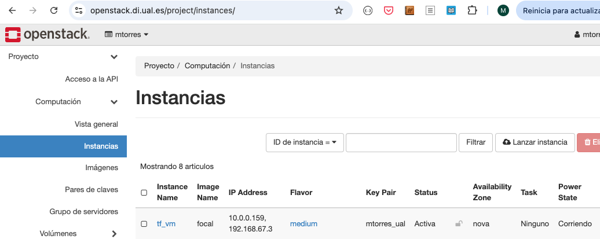
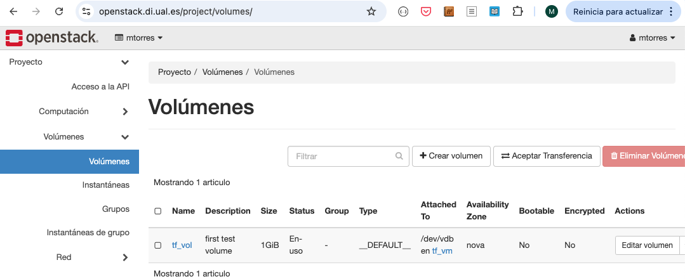

////
NO CAMBIAR!!
Codificación, idioma, tabla de contenidos, tipo de documento
////
:encoding: utf-8
:lang: es
:toc: right
:toc-title: Tabla de contenidos
:doctype: book
:linkattrs:

:figure-caption: Fig.

////
Nombre y título del trabajo
////
# Despliegue de infraestructura cloud con Terraform
Cloud Computing - Máster en Tecnologías y Aplicaciones en Ingeniería Informática
José Joaquín Cañadas y Manuel Torres <jjcanada@ual.es> <mtorres@ual.es>

image::images/di.png[]

// NO CAMBIAR!! (Entrar en modo no numerado de apartados)
:numbered!: 

[abstract]
== Resumen
En este tutorial se muestra el uso de una herramienta como Terraform para construir y modificar infraestructura cloud mediante código. Se estudiarán casos de uso en OpenStack y Google Cloud.

////
COLOCA A CONTINUACION LOS OBJETIVOS
////
.Objetivos
* Conocer el papel de la Infraestructura como código en la cultura DevOps.
* Entender la utilidad y potencia de la Infraestructura como código.
* Inicializar un proveedor cloud en Terraform.
* Desplegar infraestructura en OpenStack y Google Cloud.
* Inicializar las máquinas virtuales en el momento de su creación.

[TIP]
====
Disponible el https://github.com/ualmtorres/terraform-examples.git[repositorio, window=blank] usado en este tutorial.
====

// Entrar en modo numerado de apartados
:numbered:

## Introducción

Desde hace un tiempo se oye hablar mucho de https://en.wikipedia.org/wiki/DevOps[DevOps, window=blank]. Se trata de una fusión que combina las áreas de:

* Desarrollo
* Operaciones
* Control de calidad

Es una extensión natural de metodologías https://en.wikipedia.org/wiki/Agile_software_development[Agile, window=blank] y es habitual el uso de los https://medium.com/@seanguthrie/devops-principles-the-cams-model-9687591ca37a[principios CAMS, window=blank], cuyas siglas vienen de:

* **C**ultura relacionada con comunicación humana, procesos y herramientas
* **A**utomatización de procesos
* **M**onitorización
* **S**haring feedback, buenas prácticas y conocimiento

En DevOps son habituales las prácticas siguientes:

* Planificación ágil
* Despliegue continuo (_CI/CD_). La subida de cambios al repositorio de código desencadena la ejecución de pruebas automatizadas que finalmente realizan el despliegue de los cambios tras superarse las pruebas.
* Infraestructura como código (_Infrastructure as Code_). Se trata del desarrollo de scripts para las tareas de despliegue y gestión de la infraestructura
* Contenedorización. Combinada con la Infraestructura como código, permite el despliegue instantáneo de aplicaciones en contenedores.
* Microservicios. Desarrollo de aplicaciones como un conjunto de servicios independientes. Cada servicio se despliega de forma independiente lo que facilita la escalabilidad y la actualización de los servicios.
* Infraestructura cloud. Favorece el despliegue, la disponibilidad y la automatización.

En esta asignatura ya hemos tratado las prácticas de https://ualmtorres.github.io/AsignaturaCloudComputing/#_tema_2_infraestructura_de_cloud_computing[Infraestructura cloud, window=blank] y de https://ualmtorres.github.io/AsignaturaCloudComputing/#_tema_4_servicios_de_contenedores[Contenedorización, window=blank]. En este tema nos centraremos en la Infraestructura como código, a la que podríamos caracterizar de esta forma:

* Uso de scripts para configurar de forma automática el entorno (redes, máquinas virtuales, volúmenes, …) con independencia de su estado inicial.
* Versionado y desarrollo colaborativo del código de la infraestructura mediante sistemas de control de versiones.
* Infraestructura repetible.
* Evita errores humanos.
* Se especifica el estado de lo que se quiere.

Actualmente, existen varias propuestas para hacer Infraestructura como código. Hay algunas que son específicas de un proveedor, como https://aws.amazon.com/es/cloudformation/[AWS CloudFormation, window=blank] y https://azure.microsoft.com/es-es/get-started/azure-portal/resource-manager[Azure Resource Manager, window=blank]. Otras son más genéricas y permiten trabajar con varios proveedores, como https://www.terraform.io/[Terraform, window=blank], https://www.pulumi.com/[Pulumi, window=blank] o https://www.ansible.com/[Ansible, window=blank].

En este tema estudiaremos https://www.terraform.io/[Terraform], una herramienta para construir, modificar y versionar infraestructura de forma segura y eficiente.

.La cultura DevOps
****
Si esto te parece interesante, puedes dedicar unos minutos a la lectura de estos documentos breves sobre DevOps. Presentan de forma clara y sencilla términos como _DevOps, Integración continua, Microservicios, ..._

* https://docs.microsoft.com/en-us/azure/devops/learn/what-is-devops[DevOps, window=blank]
* https://docs.microsoft.com/en-us/azure/devops/learn/what-is-continuous-integration[Integración contínua, window=blank]]
* https://docs.microsoft.com/en-us/azure/devops/learn/what-is-continuous-delivery[Entrega contínua, window=blank]]
* https://docs.microsoft.com/en-us/azure/devops/learn/what-is-devops-culture[Cultura DevOps, window=blank]]
* https://docs.microsoft.com/en-us/azure/devops/learn/what-is-infrastructure-as-code[Infraestructura como código, window=blank]]
* https://docs.microsoft.com/en-us/azure/devops/learn/what-are-microservices[Microservicios, window=blank]]
* https://docs.microsoft.com/en-us/azure/devops/learn/what-is-monitoring[Monitorización, window=blank]]
****

## Terraform

https://www.terraform.io/[Terraform] es una herramienta para construir, modificar y versionar infraestructura de forma segura y eficiente. Es un proyecto Open Source desarrollado por https://www.hashicorp.com/about[HashiCorp, window=blank], surgido en 2014. Genera un plan de ejecución (preview) indicando qué hará para conseguir el estado deseado. Si hay cambios en la configuración, Terraform detecta los cambios y crea un plan incremental para alcanzar el nuevo estado.

### Instalación

La instalación de Terraform es muy sencilla. Se https://www.terraform.io/[descarga, window=blank] como un binario que hay que descoprimir. Luego se coloca en un directorio incluido en el PATH del sistema. Probamos su funcionamiento desde la terminal con `terraform`

[source, bash]
----
Usage: terraform [global options] <subcommand> [args]

The available commands for execution are listed below.
The primary workflow commands are given first, followed by
less common or more advanced commands.

Main commands:
  init          Prepare your working directory for other commands
  validate      Check whether the configuration is valid
  plan          Show changes required by the current configuration
  apply         Create or update infrastructure
  destroy       Destroy previously-created infrastructure

All other commands:
  console       Try Terraform expressions at an interactive command prompt
  fmt           Reformat your configuration in the standard style
  force-unlock  Release a stuck lock on the current workspace
  get           Install or upgrade remote Terraform modules
  graph         Generate a Graphviz graph of the steps in an operation
  import        Associate existing infrastructure with a Terraform resource
  login         Obtain and save credentials for a remote host
  logout        Remove locally-stored credentials for a remote host
  metadata      Metadata related commands
  output        Show output values from your root module
  providers     Show the providers required for this configuration
  refresh       Update the state to match remote systems
  show          Show the current state or a saved plan
  state         Advanced state management
  taint         Mark a resource instance as not fully functional
  test          Experimental support for module integration testing
  untaint       Remove the 'tainted' state from a resource instance
  version       Show the current Terraform version
  workspace     Workspace management

Global options (use these before the subcommand, if any):
  -chdir=DIR    Switch to a different working directory before executing the
                given subcommand.
  -help         Show this help output, or the help for a specified subcommand.
  -version      An alias for the "version" subcommand.
----

### Sintaxis de los archivos

Hashicorp usa su propio lenguaje de configuración para la descripción de la infraestructura.

Los archivos Terraform se pueden escribir en dos formatos:

* HashiCorp Configuration Language (HCL). La extensión de los archivos es `.tf`
* JSON. La extensión de los archivos es `.tf.json`

El formato preferido es HCL, ya que es más legible y fácil de escribir. No obstante, el lenguaje HCL es un poco complicado y puede ser confuso al principio, especialmente si se quieren hacer bucles o condicionales.

[NOTE]
====
https://www.pulumi.com/[Pulumi], una herramienta similar a Terraform, permite escribir la configuración en varios lenguajes de programación como Python, TypeScript, Go, ... Sin embargo, Terraform es más popular y tiene una comunidad más grande. Esto, unido a que el estado en Terraform se almacena en local de forma predeterminada, mientras que en Pulumi se almacena en la nube, hace que Pulumi pueda despertar recelos en entornos corporativos.

Puedes obtener más información en el tutorial https://ualmtorres.github.io/seminario-pulumi/[Infraestructura como código con Pulumi].
====

### Recursos y módulos

El objetivo de Terraform es declarar _recursos_. Todas las características del lenguaje giran en torno a hacer que la definición de recursos sea más flexible y conveniente. 

Los recursos puede agruparse en módulos, que crean una unidad de configuración de nivel más alto. Un recurso describe un objeto básico de infraestructura, mientras que un módulo describe un conjunto de objetos y sus relaciones para crear un sistema mayor.

.Title
.Ejemplo de un recurso para crear en OpenStack una IP flotante de la red `externa`
====
[source, bash]
----
resource "openstack_networking_floatingip_v2" "tf_vm_ip" {
  pool = "externa"
}
----
====

Una configuración Terraform consta de un módulo raíz donde comienza la evaluación. El módulo puede contener módulos hijo que se van llamando unos a otros. La configuración más sencilla de módulo contendría sólo un archivo `.tf` (`main.tf`) aunque se recomienda una organización como la siguiente:

* `main.tf`: Configuración de lo recursos del módulo
* `providers.tf`: Proveedor de los recursos del módulo
* `variables.tf` : Variables de entrada
* `terraform.tfvars`: Valores de las variables de entrada
* `output.tf`: Variables de salida

[TIP]
====
El archivo `terraform.tfvars` es opcional. Se usa para definir valores de variables de entrada. Si no se usa, se pueden definir las variables en el archivo `variables.tf`. Sin embargo, es una buena práctica usar `terraform.tfvars` para separar la configuración de la declaración de variables y dejar `variables.tf` para la declaración de variables. Además, de cara al control de versiones, se facilita la gestión de las variables de entorno, añadiendo el archivo `terraform.tfvars` al `.gitignore`. Esto evita que se suban al repositorio valores sensibles como contraseñas o claves de acceso.
====

Ejemplo de organización:
[source, bash]
----
├── README.md
├── main.tf
├── providers.tf
├── variables.tf
├── terraform.tfvars
├── outputs.tf
├── ...
├── modules/
│   ├── moduleA/
│   │   ├── README.md
│   │   ├── main.tf
│   │   ├── providers.tf
│   │   ├── variables.tf
│   │   ├── outputs.tf
│   ├── moduleB/
│   ├── .../
----

### Providers

Terraform puede crear _stacks_ de infraestructura en varios proveedores. Por ejemplo, una configuración podría crear infraestructura en Google Cloud Platform y en OpenStack-DI.

Hay gran cantidad de proveedores Terraform, tanto https://www.terraform.io/docs/providers/index.html[oficiales, window=blank], mantenidos por Hashicorp, (AWS, Azure, Google Cloud Platform, Heroku, Kubernetes, MongoDB Atlas, OpenStack, VMware Cloud, VMware vSphere, ...) como de la https://www.terraform.io/docs/providers/type/community-index.html[comunidad y terceros, window=blank] (OpenShift, Trello, Telegram, ...)

### Variables

#### Variables de entrada

Las variables de entrada se usan como parámetros para los módulos. Se crean mediante bloques `variable`

[source, tf]
----
variable "openstack_user_name" {
    type = string
    description = "The username for the Tenant."
    default  = "mtorres" <1>
}

variable "security_groups" {
    type    = list(string)
    default = ["default"]
}
----
<1> Valor por defecto. Esto es opcional y se usa si no se especifica un valor en el archivo `terraform.tfvars`.

Las variables se usan siguiendo esta sintaxis `var.<variable>`.

[source, tf]
----
provider "openstack" {
  user_name   = var.openstack_user_name <1>
  ....
}
----
<1> Uso de la variable `openstack_user_name`

Más información sobre la declaración, uso de variables y constructores de tipos en la https://www.terraform.io/docs/configuration/variables.html[documentación oficial, window=blank].

#### Configuración de variables

Las variables se pueden configurar de varias formas:

* En el archivo `variables.tf` con un valor por defecto.
* En el archivo `terraform.tfvars` con un valor específico.

##### Declaración de variables sin valor por defecto

Por ejemplo, si define una variable `user_name` en `variables.tf`, se puede configurar en `terraform.tfvars` con un valor específico.

.Archivo `variables.tf`
[source, tf]
----
variable "user_name" {
  type        = string
  description = "The username for the Tenant."
}
----

.Archivo `terraform.tfvars`
[source, tf]
----
user_name = "mtorres"
----

##### Declaración de variables con valor por defecto

Si se define una variable `user_name` en `variables.tf` con un valor por defecto, se puede configurar en `terraform.tfvars` con un valor específico o dejar el valor por defecto.

.Archivo `variables.tf`
[source, tf]
----
variable "user_name" {
  type        = string
  description = "The username for the Tenant."
  default     = "mtorres" <1>
}
----
<1> Valor por defecto

.Archivo `terraform.tfvars`
[source, tf]
----
user_name = "mtorres"
----

Si se define una variable en `variables.tf` con un valor por defecto y no se configura en `terraform.tfvars`, se usará el valor por defecto. En cambio, si se configura en `terraform.tfvars`, se usará el valor específico, independientemente del valor por defecto.

#### Variables de entorno

Terraform permite el uso de variables de entorno para la configuración. Se definen con la sintaxis `TF_VAR_<variable>`.

Por ejemplo, si se define una variable `PASSWORD` en Terraform, se puede acceder a ella en la shell como `TF_VAR_PASSWORD`. Terraform la reconocerá como `PASSWORD`.

[source, bash]
----
$ export TF_VAR_PASSWORD=xxxx
----

Posterirmente, se accede a la variable en Terraform como `var.PASSWORD`.

[source, tf]
----
provider "openstack" {
  user_name   = var.openstack_user_name
  tenant_name = var.openstack_tenant_name
  password    = var.PASSWORD <1>
  auth_url    = var.openstack_auth_url
}
----
<1> Uso de la variable

La variable `PASSWORD` no tiene por qué estar definida en el archivo `variables.tf`. Terraform la reconocerá como `PASSWORD`. Además, Terraform no la incluirá en el archivo de estado. Esto es muy útil para almacenar valores sensibles como contraseñas o claves de acceso. 

[WARNING]
====
Configurar contraseñas en variables de entorno es una buena práctica de seguridad. Por contra, almacenar contraseñas en archivos de configuración es una mala práctica, ya que si se suben al repositorio de código quedan expuestas y además se almacenan en el archivo de estado de Terraform, lo que puede ser un problema de seguridad.
====

#### Variables de salida

Las variables de salida se usan para pasar valores a otros módulos o para mostrar en el CLI un resultado tras un despliegue con `terraform apply`.

Las variables de salida se definen con bloques `output` y un identificador único. Normalmente, toman como valor una expresión (p.e. una IP generada para una instancia creada).

[source, tf]
----
output tf_vm_Floating_IP {
  value      = openstack_networking_floatingip_v2.tf_vm_ip.address <1>
  depends_on = [openstack_networking_floatingip_v2.tf_vm_ip] <2>
}
----
<1> Expresión que devuelve la dirección IP de un recurso previamente creado.
<2> Argumento opcional que establece una dependencia con un recurso creado.

### Archivo de estado

Terraform guarda la información de la infraestructura creada en un archivo de estado Terraform (`terraform.tfstate`). Este archivo se usa al ejecutar los comandos `terraform plan` o `terraform apply` para determinar los cambios a aplicar. Gracias a esto se puede:

* Seguir la pista de los cambios en la infraestructura
* Actualizar sólo los componentes necesarios
* Eliminar componentes

Una característica muy interesante de Terraform es la idempotencia, así como la facilidad para aplicar cambios. Si volvemos a ejecutar un despliegue con `terraform apply` y no ha habido cambios en los archivos de configuración tras el último despliegue (cuyo estado quedó almacenado en el archivo `.tfstate`), el despliegue quedará intacto. Es decir, no se volverá a crear infraestructura repetida, ni se reemplazará la infraestructura creada por una nueva si no hay cambios en los archivos de configuración.

Sin embargo, si modificamos la configuración modificando los archivos Terraform estaremos indicando un nuevo estado al que queremos llegar. En este caso, al aplicar `terraform apply` sí se desplegarán los cambios realizados en la configuración. Sin embargo, sólo se desplegarán los recursos correspondientes a los cambios realizados, manteniendo intacta la configuración no modificada.

.Atención al archivo de estado
****
**El archivo de estado puede contener información sensible por lo que debe quedar excluido en el sistema de control de versiones.** 

[TIP]
====
Recuerda incluir el archivo de estado en https://github.com/github/gitignore/blob/master/Terraform.gitignore[.gitignore, window=blank].
====

Además, el estado local no funciona bien en un entorno colaborativo, ya que la ejecución local almacenaría el estado en cada equipo local y no coincidirá con el estado almacenado en otro equipo de otro miembro. Si dos o más personas necesitan ejecutar la configuración Terraform, se necesita almacenar el archivo en un lugar remoto común a fin de evitar errores y no dañar la infraestructura existente.

Más información sobre https://www.terraform.io/docs/state/remote.html[estado remoto, window=blank] y https://www.terraform.io/docs/backends/[configuración de backends, window=blank].

[NOTE]
====
Google Cloud Storage ofrece https://www.terraform.io/docs/backends/types/gcs.html[soporte para el almacenamiento del estado de Terraform, window=blank] con la opción de bloqueo. Crea un segmento (_bucket_) y activa el versionado de objetos para recuperación de estados anteriores ante errores accidentales. 

Terraform también permite usar una base de datos PostgreSQL para el almacenamiento del estado con la opción de bloqueo. Aprovisiona una máquina virtual con SQL o usa un servicio de PostgreSQL en la nube para el almacenamiento de estado en PostgreSQL.

Actualmente. Terraform da una lista bastante amplia de backends para almacenamiento de estado 

* https://www.terraform.io/docs/backends/types/azurerm.html[Azure Blob Storage, window=blank]
* https://www.terraform.io/docs/backends/types/consul.html[Consul, window=blank]
* https://www.terraform.io/docs/backends/types/etcdv3.html[etcd, window=blank]
* https://www.terraform.io/docs/backends/types/gcs.html[Google Cloud Storage, window=blank]
* https://www.terraform.io/docs/backends/types/http.html[cliente REST HTTP, window=blank]. Prueba con este https://medium.com/@meson10/remote-terraform-state-server-47c481983268[ejemplo, window=blank] en Go MongoDB
* https://www.terraform.io/docs/backends/types/kubernetes.html[Kuberntes Secrets, window=blank] (Máximo 1 MB)
* https://www.terraform.io/docs/backends/types/pg.html[PostgreSQL, window=blank]
* https://www.terraform.io/docs/backends/types/s3.html[Amazon S3, window=blank]
* https://www.terraform.io/docs/backends/types/swift.html[OpenStack Swift, window=blank]
* ...
====
****
### Gestión de la infraestructura

Normalmente, estos son los pasos que se deben seguir para construir, mantener y eliminar una infraestructura con Terraform.

. Inicializar el directorio del proyecto Terraform (`terraform init`). El comando descarga todos los componentes necesarios, incluyendo módulos y plugins. La inicialización crea un archivo `.terraform` en el directorio de trabajo con los plugins necesarios. La información necesaria sobre los plugins y proveedores a descargar se suele encontrar en el archivo `providers.tf`.
. Crear un plan de ejecución (`terraform plan`). El comando determina las acciones necesarias para alcanzar el estado deseado especificado en los archivos de configuración (p.e. `main.tf`).
. Crear o modificar la infraestructura (`terraform apply`). Terraform es idempotente. Al usar este comando sólo se despliegan los recursos correspondientes a los cambios que se hayan realizado en los archivos de configuración (p.e. `main.tf`), sin volver a crear lo que ya existe y no se ha modificado. Para esto, Terraform se basa en lo almacenado en los archivos de estado, que guardan la información de la infraestructura creada en el último despliegue.
. Mostrar las variables de salida de un despliegue (`terraform output`). 
. Eliminar la infraestructura (`terraform destroy`). Se usa para eliminar la infraestructura creada.

[NOTE]
====
Es posible que en algún momento se produzca un fallo en un despliegue. Por ejemplo, se realiza un despliegue de una infraestructura y se produce un error por falta de recursos. En una situación como esta, Terraform no puede deshacer los cambios realizados y quizá no pueda eliminar los recursos creados. En este caso, se puede usar el comando `terraform refresh` para actualizar el estado de la infraestructura con la información real de los recursos creados. Esto reconciliará el estado de la infraestructura con la información real de los recursos creados. Posteriormente, se puede usar `terraform destroy` para eliminar la infraestructura.
====

## Despliegue en OpenStack

El provider https://registry.terraform.io/providers/terraform-provider-openstack/openstack/latest/docs[OpenStack, window=blank] permite crear configuraciones Terraform para desplegar infraestructura en OpenStack. Entre los recursos que podemos gestionar están:

* Instancias
* Credenciales
* Imágenes
* Redes
* Almacenamiento de bloques
* Almacenamiento NFS
* Balanceadores de carga

### Configuración del provider

Para usarlo hay que configurar sus https://registry.terraform.io/providers/terraform-provider-openstack/openstack/latest/docs[parámetros de acceso, window=blank] (p.e. usuario, proyecto, endpoint, ...). Lo haremos en un archivo `providers.tf`. El archivo `providers.tf` se usa para definir y configurar los proveedores de los recursos del módulo.

.El archivo `providers.tf`
[source, tf]
----
terraform {
  required_version = ">= 0.14.0"
  required_providers {
    openstack = {
      source  = "terraform-provider-openstack/openstack"
      version = "~> 1.53.0"
    }
  }
}

provider "openstack" {
  user_name   = var.openstack_user_name
  tenant_name = var.openstack_tenant_name
  password    = var.PASSWORD <1>
  auth_url    = var.openstack_auth_url
}
----
<1> La contraseña se accede a través de la variable de entorno `TF_VAR_PASSWORD` para evitar almacenarla en el archivo de configuración y en el archivo de estado. Esto es una buena práctica de seguridad.

Se usan las variables definidas en el archivo `variables.tf`

[source, tf]
----
variable "openstack_user_name" {
    description = "The username for the Tenant."
    default  = "your-openstack-user"
}

variable "PASSWORD" {
    description = "The user password."
}

variable "openstack_tenant_name" {
    description = "The name of the Tenant."
    default  = "your-openstack-project"
}

variable "openstack_auth_url" {
    description = "The endpoint url to connect to OpenStack."
    default  = "https://openstack.di.ual.es:5000/v3"
}

variable "openstack_keypair" {
    description = "The keypair to be used."
    default  = "your-openstack-keypair-name"
}
----

.Uso de variables de entorno
****

Para evitar introducir datos sensibles en los archivos de configuración y evitar que queden expuestos en el sistema de control de versiones es buena práctica configurar valores sensibles en variables de entorno.

El convenio de Terraform es que definamos en la shell las variables precedidas de `TF_VAR_`. Por ejemplo, definimos una variable de entorno `TF_VAR_PASSWORD` que será accedida por Terraform como `PASSWORD`.

.Nomemclatura de variables de entorno
[width="100%",options="header,footer"]
|====================
| Variable de entorno |  Variable Terraform 
| `TF_VAR_PASSWORD` |  `PASSWORD`
|====================

Seguiremos estos pasos:

. Configurar la variables en la shell

+
[source, bash]
----
$ export TF_VAR_PASSWORD=xxxx
----

. Cargar la variable en Terraform 

+
.Archivo `variables.tf`
[source, tf]
----
...
variable "PASSWORD" {} <1>
...
----
<1> La variable de entorno `TF_VAR_PASSWORD` es reconocida en Terraform como `PASSWORD`

. Usar la variable en Terraform

+
.Archivo `providers.tf`
[source, tf]
----
provider "openstack" {
  user_name   = var.openstack_user_name
  tenant_name = var.openstack_tenant_name
  password    = var.PASSWORD <1>
  auth_url    = var.openstack_auth_url
}
----
<1> Uso de la variable
****

### Inicializar el provider

Para inicializar ejecutar `terraform init`.

[source, bash]
----
terraform init

Initializing the backend...

Initializing provider plugins...
- Reusing previous version of terraform-provider-openstack/openstack from the dependency lock file
- Using previously-installed terraform-provider-openstack/openstack v1.53.0

Terraform has been successfully initialized!

You may now begin working with Terraform. Try running "terraform plan" to see
any changes that are required for your infrastructure. All Terraform commands
should now work.

If you ever set or change modules or backend configuration for Terraform,
rerun this command to reinitialize your working directory. If you forget, other
commands will detect it and remind you to do so if necessary.
(base) MacBook-Pro-de-Manuel:00-pruebas-carga manolo$ terraform init

Initializing the backend...

Initializing provider plugins...
- Finding terraform-provider-openstack/openstack versions matching "~> 1.53.0"...
- Installing terraform-provider-openstack/openstack v1.53.0...
- Installed terraform-provider-openstack/openstack v1.53.0 (self-signed, key ID 4F80527A391BEFD2)

Partner and community providers are signed by their developers.
If you'd like to know more about provider signing, you can read about it here:
https://www.terraform.io/docs/cli/plugins/signing.html

Terraform has created a lock file .terraform.lock.hcl to record the provider
selections it made above. Include this file in your version control repository
so that Terraform can guarantee to make the same selections by default when
you run "terraform init" in the future.

...

Terraform has been successfully initialized!

...
----

Esto creará una carpeta `.terraform` con en plugin de OpenStack instalado y disponible para ser usado en el proyecto. También crea un archivo `.terraform.lock.hcl` que registra las selecciones de proveedores realizadas. Este archivo se debe incluir en el repositorio de control de versiones para garantizar que Terraform haga las mismas selecciones por defecto cuando se ejecute `terraform init` en el futuro.

.Actualización de la configuración
****
Con el paso del tiempo, puede que haya que actualizar la configuración de Terraform. La actualuización comprendería módulos, plugins y proveedores. Para ello, ejecutar `terraform init -upgrade` en el directorio del proyecto.
****

### Despliegue de una instancia

La creación de una instancia se realiza con https://registry.terraform.io/providers/terraform-provider-openstack/openstack/latest/docs/resources/compute_instance_v2[openstack_compute_instance_v2, window=blank].

A continuación, crearemos una instancia denominada `tf_vm`. Cada recurso creado en Terraform se identifica con un nombre. En este caso, el nombre del recurso es `tf_vm`. Es el nombre que se use en `resource`, no el nombre asignado en `name`, es el que referencia al objeto `resource` creado. Esto permite tratar el recurso creado (p.e. para asignarle una dirección IP flotante, para conectarle un volumen, ...).

En el ejemplo siguiente se ilustra la creación de una máquina virtual, una dirección IP flotante (https://registry.terraform.io/providers/terraform-provider-openstack/openstack/latest/docs/resources/networking_floatingip_v2[`openstack_networking_floatingip_v2`, window=blank]) y la asignación de la IP flotante a la máquina virtual creada (https://registry.terraform.io/providers/terraform-provider-openstack/openstack/latest/docs/resources/compute_floatingip_associate_v2[`openstack_compute_floatingip_associate_v2`, window=blank]).

[source, terraform]
----
#Crear nodo tf_vm
resource "openstack_compute_instance_v2" "tf_vm" {<1>
  name              = "tf_vm"
  image_name        = "jammy" 
  availability_zone = "nova"
  flavor_name       = "medium"
  key_pair          = var.openstack_keypair
  security_groups   = ["default"]
  network {
    name = var.openstack_network_name <2>
  }
}

resource "openstack_networking_floatingip_v2" "tf_vm_ip" { <3>
  pool = "ext-net"
}

resource "openstack_compute_floatingip_associate_v2" "tf_vm_ip" { <4>
  floating_ip = openstack_networking_floatingip_v2.tf_vm_ip.address <5>
  instance_id = openstack_compute_instance_v2.tf_vm.id <6>
}

output tf_vm_Floating_IP { 
  value      = openstack_networking_floatingip_v2.tf_vm_ip.address <7>
  depends_on = [openstack_networking_floatingip_v2.tf_vm_ip] <8>
}
----
<1> Creación de un recurso instancia (máquina virtual) en OpenStack. El objeto recurso creado es asignado a la variable `tf_vm`.
<2> Red a la que se conectará la instancia creada. Usamos una variable de entrada almacenada en `variables.tf` con el nombre de la red.
<3> Creación de un recurso dirección IP flotante. El objeto recurso creado es asignado a la variable `tf_vm_ip`.
<4> Asociación de la IP flotante a la instancia
<5> Acceso a la dirección del recurso IP flotante creado
<6> Acceso al `id` la instancia creada
<7> Acceso a la dirección del recurso IP flotante creado
<8> Esperar a que esté creado el recurso de la IP flotante

La creación de la instancia, igual que los demás recursos, tiene un configuración específica. En este caso, se crea una instancia con las siguientes características destacadas:

* Nombre `tf_vm`
* Imagen `jammy`. Así es como se conoce a la imagen de Ubuntu 22.04 en OpenStack-DI.
* Zona de disponibilidad `nova`. Es el nombre de la zona de disponibilidad en OpenStack-DI. Una zona de disponibilidad es un conjunto de recursos de cómputo y almacenamiento que se encuentran en un solo centro de datos o en varios centros de datos cercanos.
* Sabor `medium`. Es el tamaño de la instancia. En OpenStack-DI, el tamaño `medium` es una instancia con 2 vCPUs y 4 GB de RAM.

Para desplegar la infraestructura, ejecutar `terraform apply`. Terraform mostrará un resumen de los cambios a realizar y pedirá confirmación para aplicarlos. Si la variable de entorno `TF_VAR_PASSWORD` no está definida, Terraform la solicitará. Tras confirmar, Terraform creará la infraestructura. Como resultado, se mostrará la dirección IP flotante asignada a la instancia creada. 

La figura siguiente ilustra la instancia creada en OpenStack-DI con la dirección IP flotante asignada.

Si ya no necesitamos la infraestructura creada, podemos eliminarla con `terraform destroy`. Terraform mostrará un resumen de los cambios a realizar y pedirá confirmación para aplicarlos. Tras confirmar, Terraform eliminará la infraestructura.

### Modificar el despliegue

La modificación de un despliegue se realiza modificando los archivos de configuración Terraform y ejecutando `terraform apply`. Terraform detectará los cambios y mostrará un resumen de los cambios a realizar. Tras confirmar, Terraform aplicará los cambios. 

A modo de ilustración, este ejemplo muestra cómo aplicar cambios a una configuración desplegada previamente. En este caso se trata de:

* Cambiar el _sabor_ de la instancia desplegada.
* Crear un volumen de 1GB (https://registry.terraform.io/providers/terraform-provider-openstack/openstack/latest/docs/resources/blockstorage_volume_v3[`openstack_blockstorage_volume_v3`, window=blank]).
* Conectar el volumen a la máquina virtual (https://registry.terraform.io/providers/terraform-provider-openstack/openstack/latest/docs/resources/compute_volume_attach_v2[`openstack_compute_volume_attach_v2`, window=blank]).

[source, terraform]
----
resource "openstack_compute_instance_v2" "tf_vm" {
  name              = "tf_vm"
  image_name        = "jammy"
  availability_zone = "nova"
  flavor_name       = "large" <1>
  key_pair          = var.openstack_keypair
  security_groups   = ["default"]
  network {
    name = var.openstack_network_name
  }
}

...

resource "openstack_blockstorage_volume_v3" "tf_vol" { <2>
  name        = "tf_vol"
  description = "first test volume"
  size        = 1 <3>
}

resource "openstack_compute_volume_attach_v2" "va_1" { <4>
  instance_id = "${openstack_compute_instance_v2.tf_vm.id}" <5>
  volume_id   = "${openstack_blockstorage_volume_v3.tf_vol.id}" <6>
}
----
<1> Modificación del sabor de la imagen
<2> Creación de un recurso volumen
<3> Especificación del tamaño del volumen
<4> Conexión del volumen a la instancia
<5> Acceso al `id` la instancia
<6> Acceso al `id` del volumen creado

Al ejecutar con `terraform apply`, Terraform nos informará de los cambios detectados y de la nueva configuración. La nueva configuración se aplicará si confirmamos la operación. Una vez aplicados desplegados los cambios, los recursos creados se mostrarán en el panel de control de OpenStack-DI, mostrando la instancia modificada y el volumen creado y conectado a la instancia. La figura siguiente ilustra el volumen creado y conectado a la instancia.

### Ejecutar un script de inicialización

Una característica muy interesante en el despliegue de una instancia es la posibilidad de ejecutar un script de inicialización durante su creación. Esto permite la creación de instancias con paquetes instalados y configurados.

Terraform permite esta operación en OpenStack pasando un script en el parámetro `user_data` al crear la instancia. 

[NOTE]
====
Si se modifica el valor de `user_data` se creará un nuevo servidor si se usa `terraform apply`.
====

A continuación se muestra un script `install_mysql.sh` que configura una base de datos MySQL inicializada con una base de datos de ejemplo. El script realiza las siguientes operaciones:

* Actualizar el repositorio de paquetes.
* Instalar un servidor MySQL con el password `my_password`.
* Descargar un archivo con un script SQL para inicializar una base de datos de ejemplo.
* Ejecutar el archivo SQL para inicializar la base de datos. La inicialización consiste en la creación de una base de datos denominada `SG (Sporting Goods)`, la creación de una tabla denominada `s_customers`, la inserción de datos en la tabla y la creación de un usuario `SG` con permisos sobre la base de datos.
* Modificar el archivo de configuración de MySQL (`mysqld.cnf`) para que admita conexiones desde cualquier lugar.

.El script `install_mysql.sh`
[source, bash]
----
#!/bin/bash

sudo debconf-set-selections <<< 'mysql-server mysql-server/root_password password my_password'
sudo debconf-set-selections <<< 'mysql-server mysql-server/root_password_again password my_password'
sudo apt update
sudo apt -y install mysql-server
wget https://gist.githubusercontent.com/ualmtorres/f8d0e5ea79a0e570f495087724288c6d/raw/0a894b23466bb6eea520a05559372e148e6e5803/sginit.sql -O /home/ubuntu/sginit.sql
mysql -h "localhost" -u "root" "-pmy_password" < "/home/ubuntu/sginit.sql"

sudo sed -i 's/127.0.0.1/0.0.0.0/g' /etc/mysql/mysql.conf.d/mysqld.cnf
sudo service mysql restart
----

Para crear la instancia con Terraform basta con crear el recurso pasando a la propiedad `user_data` el nombre y la ruta del script de inicialización. En este caso, se supone que el script de inicialización está en el mismo directorio que el script Terraform.

[source, tf]
----
#Crear nodo mysql
resource "openstack_compute_instance_v2" "mysql" {
  name              = "mysql"
  image_name        = "jammy"
  availability_zone = "nova"
  flavor_name       = "medium"
  key_pair          = var.openstack_keypair
  security_groups   = ["default"]
  network {
    name = var.openstack_network_name
  }
  user_data = file("install_mysql.sh") <1>
}
----
<1> Pasar el script de inicialización de la instancia

Tras ejecutar `terraform apply`, Terraform creará la instancia con el script de inicialización. El script se ejecutará durante la creación de la instancia. La instancia creada tendrá un servidor MySQL instalado y configurado con la base de datos `SG` inicializada.

### Archivos de plantilla

Una característica muy interesante de Terraform es la posibilidad de definir scripts con contenido dinámico. Se trata de archivos que interpolan el valor de variables generadas durante el proceso de despliegue.

El procedimiento es el siguiente:

* Generar variables de salida 
* Crear archivos de plantilla con extensión `.tpl` que obtengan los valores de dichas variables con la sintaxis siguiente `${nombre-variable}`.
* Interpolar mediante la función `templatefile` donde sea necesario los archivos plantilla con la sintaxis siguiente `data.template_file.objeto-template-file.rendered`.

Para ilustrar su uso:

* Interpolaremos las variables en el archivo de plantilla
* Crearemos una plantilla que obtenga la dirección IP de un servidor MySQL creado en el despliegue (almacenada en una variable `output`). Dicha variable se usará para definir una variable de entorno en la instancia definida y para cambiar las variables de entorno de Apache.
* Crearemos una instancia inicializada con el archivo de la plantilla. La instancia será un servidor web inicializado con una aplicación PHP sencilla. La aplicación usará la variable de entorno inicializada por el script. La variable de entorno contiene la dirección IP del servidor MySQL al que accede la aplicación para mostrar sus datos.

.Proceso de interpolación de las variables en el archivo `main.tf`
[source, tf]
----
data "template_file" "install_appserver" {
  template = file("install_appserver.tpl") <1>
  vars = {
    mysql_ip = openstack_compute_instance_v2.mysql.network.0.fixed_ip_v4 <2>
  }
  depends_on = [openstack_compute_instance_v2.mysql] <3>
}
----
<1> Archivo de plantilla
<2> Inicialización de la variable
<3> Esperar a que esté creada la instancia para obtener su IP.

.Archivo plantilla `install_appserver.tpl`
[source, bash]
----
#!/bin/bash
echo "export MYSQL_SERVER=${mysql_ip}" >> /home/ubuntu/.profile <1>

sudo apt-get update
sudo apt-get install -y apache2 php php-mysql libapache2-mod-php php-mcrypt
sudo chgrp -R www-data /var/www
sudo chmod -R 775 /var/www
sudo chmod -R g+s /var/www
sudo useradd -G www-data ubuntu
sudo chown -R ubuntu /var/www/

sudo rm /var/www/html/index.html
wget https://gist.githubusercontent.com/ualmtorres/1c833f9b471fa7351e2725731596f45e/raw/a66b26d90b5f75c3a37cfe12a2370b57d2768132/sginit.php -O /var/www/html/index.php

echo "export MYSQL_SERVER=${mysql_ip}" >> /etc/apache2/envvars <2>
sudo service apache2 restart
----
<1> Inicialización de una variable de entorno con el valor de la variable `mysql_ip`.
<2> Inicialización de una variable de entorno Apache con el valor de la variable `mysql_ip`.

.Creación del recurso con el script de inicialización interpolado
[source, bash]
----
#Crear nodo appserver
resource "openstack_compute_instance_v2" "appserver" {
  name              = "appserver"
  image_name        = "Ubuntu 16.04 LTS"
  availability_zone = "nova"
  flavor_name       = "medium"
  key_pair          = "mtorres_ual"
  security_groups   = ["default"]
  network {
    name = "desarrollo-net"
  }

  user_data = data.template_file.install_appserver.rendered <1> 

  depends_on = [openstack_compute_instance_v2.mysql]

}
----
<1> Interpolación del archivo plantilla

### Ejemplo completo

En este apartado crearemos un escenario más complejo que combine creación de recursos de red e instancias aprovisionadas durante su creación.

Se trata de crear lo siguiente:

* Red denominada `desarrollo-net`. Contendrá una subred denominada `desarrollo-subnet` con direcciones `10.2.0.0./24` y estos servidores DNS: `150.214.156.2 8.8.8.8`.
* Router denominado `desarrollo-router` que conecte la red exterior `ext-net` con la red `desarrollo-net` creada anteriormente.
* Un servidor MySQL inicializado con el script `install_mysql.sh`
* Un servidor Web con PHP inicializado con el script `install_appserver.tpl`

La figura siguiente ilustra el diagrama de la infraestructura.

image::images/EjemploCompleto.png[]

Tras finalizar el despliegue tendremos la configuración de red realizada, un servidor MySQL con una base de datos inicializada y servidor web con aplicación PHP de catálogo de productos desplegada. Terraform nos informará con las variables de salida.

[source]
----
Apply complete! Resources: 10 added, 0 changed, 0 destroyed.

Outputs:

Appserver_Floating_IP = 192.168.68.112
MySQL_Floating_IP = 192.168.68.135
----

Si accedemos a la dirección IP del servidor web veremos la aplicación de catálogo mostrando los productos almacenados en la base de datos.

image::images/SGApp.png[]

## Despliegue en Google Cloud

El provider https://registry.terraform.io/providers/hashicorp/google/latest/docs[Google Cloud] permite crear configuraciones Terraform para desplegar configuraciones en el gran conjunto de servicios de Google Cloud. Entre los recursos que podemos gestionar están:

* Infraestructura (Instancias, Imágenes, Redes, ...)
* App Engine
* Bases de datos (Cloud SQL, Big Query, Firebase, ...)
* Kubernetes
* Cloud Storage
* ...

### Crear una clave para la Cuenta de servicio

* Seleccionar el proyecto Google Cloud.
* En el menú de navegación seleccionar `IAM y administración | Cuentas de servicio`.
* Seleccionar `Crear cuenta de servicio`.
* Darle un nombre (p.e. `terraform`)
* Seleccionar `Crear y continuar`.
* En el paso `Otorga a esta cuenta de servicio acceso al proyecto` del asistente, seleccionar el rol `Proyecto -> Editor`.
* Pulsar el botón `Listo`. No es necesario configurar nada más en este asistente.
* Editar la Cuenta de servicio. En la sección `Claves` seleccionar `Agregar clave | Crear clave nueva`.
* Dejar `JSON` en el tipo de clave..
* Seleccionar `Crear`. A continuación se descargará a nuestro equipo la clave privada.
* En el menú de navegación seleccionar `IAM y adminsitración | IAM`, en la pestaña de `Permisos` localizar la cuenta de servicio creada para `terraform` y pulsar sobre `Editar cuenta principal`.
* Pulsar sobre `Agregar otra función`. Seleccionar `Service Networking - Administrador de Service Networking`.
* Guardar los cambios.

### Configuración del provider

Para usarlo hay que configurar sus https://registry.terraform.io/providers/hashicorp/google/latest/docs[parámetros de acceso]. Lo haremos en un archivo `providers.tf`

.El archivo `providers.tf`
[source, tf]
----
terraform {
  required_providers {
    google = {
      source  = "hashicorp/google"
      version = "6.5.0"
    }
  }
}

provider "google" {
  credentials = file("../gcp-identity.json") <1>

  project = var.gcp-project
  region  = "us-central1"
  zone    = "us-central1-c"
}
----
<1> Ruta al archivo de credenciales de la cuenta de servicio descargadas en el paso anterior.

Se usan las variables definidas en el archivo `variables.tf`

[source, tf]
----
variable "gcp-username" {
  description = "GCP user name"
  default     = "mtorres"
}

variable "gcp-project" {
  description = "GCP project"
  default     = "cc2025-mtorres"
}

variable "gcp-network" {
  description = "GCP network"
  default     = "terraform-network"
}
----

### Inicializar el provider

Para inicializar ejecutar `terraform init`.

[source, bash]
----
Initializing the backend...

Initializing provider plugins...
- Finding hashicorp/google versions matching "6.5.0"...
- Installing hashicorp/google v6.5.0...
- Installed hashicorp/google v6.5.0 (signed by HashiCorp)

Terraform has created a lock file .terraform.lock.hcl to record the provider
selections it made above. Include this file in your version control repository
so that Terraform can guarantee to make the same selections by default when
you run "terraform init" in the future.

Terraform has been successfully initialized!

You may now begin working with Terraform. Try running "terraform plan" to see
any changes that are required for your infrastructure. All Terraform commands
should now work.

If you ever set or change modules or backend configuration for Terraform,
rerun this command to reinitialize your working directory. If you forget, other
commands will detect it and remind you to do so if necessary.
----

Esto creará una carpeta `.terraform` con en plugin de Google Cloud instalado y disponible para ser usado en el proyecto. También crea un archivo `.terraform.lock.hcl` que registra las selecciones de proveedores realizadas. Este archivo se debe incluir en el repositorio de control de versiones para garantizar que Terraform haga las mismas selecciones por defecto cuando se ejecute `terraform init` en el futuro.

### Configuración de la red

Para crear una red en Google Cloud usaremos el recurso https://registry.terraform.io/providers/hashicorp/google/latest/docs/resources/compute_network[google_compute_network]. En el siguiente ejemplo se crea una red denominada `terraform-network`.

[source, tf]
----
resource "google_compute_network" "vpc_network" {
  name = var.gcp-network
}
----

También crearemos las reglas de firewall para permitir el tráfico de entrada y salida en la red. Para ello usaremos el recurso https://registry.terraform.io/providers/hashicorp/google/latest/docs/resources/compute_firewall[google_compute_firewall]. En este ejemplo veremos cómo añadir una regla ICMP que permita el tráfico PING desde cualquier origen, una regla SSH que permita el tráfico SSH desde cualquier origen y una regla que permite todo el tráfico interno. El tráfico interno lo entenderemos dentro de la región `us-central1` con máscara de red `10.128.0.0/20`.

[source, tf]
----
resource "google_compute_network" "vpc_network" {
  name = var.gcp-network
}

resource "google_compute_firewall" "firewall-icmp" {
  name    = "terraform-allow-icmp"
  network = google_compute_network.vpc_network.name

  allow {
    protocol = "icmp"
  }

  source_ranges = ["0.0.0.0/0"]
}

resource "google_compute_firewall" "firewall-ssh" {
  name    = "terraform-allow-ssh"
  network = google_compute_network.vpc_network.name

  allow {
    protocol = "tcp"
    ports    = ["22"]
  }

  source_ranges = ["0.0.0.0/0"]
}

resource "google_compute_firewall" "firewall-internal" {
  name    = "terraform-allow-internal"
  network = google_compute_network.vpc_network.name

  allow {
    protocol = "tcp"
    ports    = ["0-65535"]
  }

  allow {
    protocol = "udp"
    ports    = ["0-65535"]
  }

  allow {
    protocol = "icmp"
  }

  source_ranges = ["10.128.0.0/20"]
}
----

### Despliegue de una instancia

La creación de una instancia se realiza con https://registry.terraform.io/providers/hashicorp/google/latest/docs/resources/compute_instance[google_compute_instance].

A continuación, crearemos una instancia denominada `tf-vm`. El nombre que se use en `resource`, no el nombre asignado en `name`, es el que referencia al objeto resource creado. Esto permite tratar el recurso creado (p.e. para asignarle una dirección IP externa, para conectarle un volumen, …​).

En el ejemplo siguiente se ilustra la creación de una máquina virtual con una dirección IP efímera.

[NOTE]
====
De forma predeterminada, si no se indica ninguna dirección IP fija, Google Cloud creará una efímera para la máquina virtual.
====

[source, tf]
----
resource "google_compute_instance" "tf-vm" { <1>
  name         = "tf-vm"
  zone         = "us-central1-c"
  machine_type = "n1-standard-1"
  boot_disk {
    initialize_params {
      image = "debian-cloud/debian-11"
    }
  }

  # Add SSH access to the Compute Engine instance
  metadata = {
    ssh-keys = "${var.gcp-username}:${file("~/.ssh/id_rsa.pub")}"
  }

  # Startup script
  # metadata_startup_script = "${file("update-docker.sh")}"

  network_interface { <2>
    network    = var.gcp-network
    subnetwork = var.gcp-network

    access_config {} <3>
  }
}

output "tf-vm-internal-ip" { <4>
  value      = google_compute_instance.tf-vm.network_interface.0.network_ip
  depends_on = [google_compute_instance.tf-vm]
}

output "tf-vm-ephemeral-ip" { <5>
  value      = google_compute_instance.tf-vm.network_interface.0.access_config.0.nat_ip
  depends_on = [google_compute_instance.tf-vm]
}
----
<1> Creación de un recurso instancia (máquina virtual) en Google Cloud. El objeto recurso creado es asignado a la variable `tf-vm`.
<2> Red a la que se conectará la instancia creada.
<3> Dejar `access_config` sin configurar hará que se genere una dirección IP efímera.
<4> Dirección IP interna de la instancia
<5> Dirección IP efímera de la instancia

### Modificar el despliegue

A modo de ilustración este ejemplo muestra cómo aplicar cambios a una configuración desplegada previamente. En este caso se trata de:

* Cambiar el tipo de máquina de la instancia desplegada a `n1-standard-2`.
* Crear un volumen de 1GB (https://registry.terraform.io/providers/hashicorp/google/latest/docs/resources/compute_disk[`google_compute_disk`]).
* Conectar el volumen a la máquina virtual (https://registry.terraform.io/providers/hashicorp/google/latest/docs/resources/compute_attached_disk[`google_compute_attached_disk`]).

[source, tf]
----
resource "google_compute_instance" "tf-vm" {
  name         = "tf-vm"
  zone         = "us-central1-c"
  machine_type = "n1-standard-2" <1>
  boot_disk {
    initialize_params {
      image = "debian-cloud/debian-11"
    }
  }
...
resource "google_compute_disk" "tf-disk" { <2>
  name = "tf-disk"
  type = "pd-ssd" <3>
  size = 1 <4>
}

resource "google_compute_attached_disk" "attached-tf-disk" {<5>
  disk     = google_compute_disk.tf-disk.id <6>
  instance = google_compute_instance.tf-vm.id <7>
}
----
<1> Modificación del tamaño de la imagen
<2> Creación de un recurso volumen
<3> Tipo SSD
<4> Especificación del tamaño del volumen
<5> Conexión del volumen a la instancia
<6> Acceso al id del volumen creado
<7> Acceso al id de la instancia

Al ejecutar con `terraform apply`, Terraform nos informará de los cambios detectados y de la nueva configuración. La nueva configuración se aplicará si confirmamos la operación. Una vez aplicados desplegados los cambios, los recursos creados se mostrarán en el panel de control de Google Cloud, mostrando la instancia modificada y el volumen creado y conectado a la instancia. Si nos conectamos a la instancia con `ssh` podremos ver el volumen creado con `lsblk`.

[source, bash]
----
$ lsblk 
NAME    MAJ:MIN RM  SIZE RO TYPE MOUNTPOINT
sda       8:0    0   10G  0 disk <1>
├─sda1    8:1    0  9.9G  0 part /
├─sda14   8:14   0    3M  0 part 
└─sda15   8:15   0  124M  0 part /boot/efi
sdb       8:16   0    1G  0 disk <2>
----
<1> Disco de la instancia
<2> Volúmen creado y conectado a la instancia

### Creación de una instancia con una dirección IP estática

De forma predeterminada, Google Cloud crea una dirección IP efímera para las instancias. Si queremos una dirección IP estática, debemos crearla y asignarla a la instancia. Para ello, usaremos el recurso https://registry.terraform.io/providers/hashicorp/google/latest/docs/resources/compute_address[`google_compute_address`]. En el siguiente ejemplo se crea una dirección IP estática denominada `tf-vm-ip`. A la hora de crear la instancia, una forma de asignar la dirección IP estática creada es a través de la configuración `access_config` de la tarjeta de red de la instancia.

[source, tf]
----
resource "google_compute_address" "tf-vm-ip" { <1>
  name = "ipv4-address-tf-vm"
}

resource "google_compute_instance" "tf-vm" { <2>
  name         = "tf-vm"
  machine_type = "n1-standard-1"
  boot_disk {
    initialize_params {
      image = "debian-cloud/debian-11"
    }
  }

...

  network_interface {
    network    = var.gcp-network
    subnetwork = var.gcp-network

    access_config {
      nat_ip = google_compute_address.tf-vm-ip.address <3>
    }
  }
}

output "tf-vm-ip" { <4>
  value      = google_compute_address.tf-vm-ip.address
  depends_on = [google_compute_instance.tf-vm]
}
----
<1> Creación de un recurso dirección IP estática
<2> Creación de un recurso instancia (máquina virtual) en Google Cloud
<3> Asignación de la dirección IP estática a la instancia
<4> Dirección IP estática de la instancia

### Ejecutar un script de inicialización

Una característica muy interesante en el despliegue de una instancia es la posibilidad de ejecutar un script de inicialización durante su creación. Esto permite la creación de instancias con paquetes instalados y configurados.

Terraform permite esta operación en GCP pasando un script en el parámetro `metadata_startup_script` al crear la instancia.

[NOTE]
====
Si se modifica el valor de `metadata_startup_script` se creará un nuevo servidor si se usa `terraform apply`.
====

En este apartado veremos cómo crear una instancia Ubuntu aprovisionada con Docker. Además, la instancia se inicializará con un archivo `docker-compose.yml` que despliega dos contenedores: un contenedor MySQL con una base de datos inicializada y otro contenedor con una aplicación PHP que muestra un catálogo de productos almacenados en el contenedor MySQL.

[NOTE]
====
El script de instalación es válido para Ubuntu. Si se usan otras otras distribuciones Linux será necesario adaptar el script de instalación a las peculiaridades de la distribución utilizada. 
====

La aplicación deberá ser accesible en Internet. Por tanto, hay que definir una regla en el cortafuegos que permita la comunicación HTTP. La regla tendrá una etiqueta asociada. Las instancias que deseen aplicar la regla incluirán la etiqueta correspondiente en su definición.

.El archivo `network-firewall.tf`
[source, bash]
----
# allow http traffic
resource "google_compute_firewall" "allow-http" { 
  name    = "tf-fw-allow-http" <1>
  network = var.gcp-network <2>
  allow {
    protocol = "tcp"
    ports    = ["80"] <3>
  }
  target_tags   = ["http"] <4>
  source_ranges = ["0.0.0.0/0"] <5>
}
----
<1> Nombre de la regla del firewall
<2> Red a la que se aplica la regla definida
<3> Puerto abierto
<4> Etiqueta para poder usar la regla
<5> Rango de direcciones IP permitidas. En este caso, cualquier dirección IP

.El archivo `main.tf`
[source, bash]
----
resource "google_compute_instance" "tf-vm" {
  name         = "tf-vm"
  zone         = "us-central1-c"
  machine_type = "n1-standard-1"
  boot_disk {
    initialize_params {
      image = "ubuntu-os-cloud/ubuntu-2204-lts" <1>
    }
  }

  # Add SSH access to the Compute Engine instance
  metadata = {
    ssh-keys = "${var.gcp-username}:${file("~/.ssh/id_rsa.pub")}"
  }

  # Add http tag to the instance to identify it in the firewall rule
  tags = ["http"] <2>

  # Startup script
  metadata_startup_script = file("setup-docker.sh") <3>

  network_interface {
    network    = var.gcp-network
    subnetwork = var.gcp-network

    access_config {}
  }
}

output "tf-vm-internal-ip" {
  value      = google_compute_instance.tf-vm.network_interface.0.network_ip
  depends_on = [google_compute_instance.tf-vm]
}

output "tf-vm-ephemeral-ip" {
  value      = google_compute_instance.tf-vm.network_interface.0.access_config.0.nat_ip
  depends_on = [google_compute_instance.tf-vm]
}
----
<1> Imagen de la instancia
<2> Etiqueta para identificar la instancia en la regla del cortafuegos
<3> Script de inicialización de la instancia

.El script `setup-docker.sh` de inicialización de la instancia
[source, bash]
----
#!/bin/bash

echo "Instalando Docker"

# Add Docker's official GPG key:
apt-get update
apt-get install -y ca-certificates curl
install -m 0755 -d /etc/apt/keyrings
curl -fsSL https://download.docker.com/linux/ubuntu/gpg -o /etc/apt/keyrings/docker.asc
chmod a+r /etc/apt/keyrings/docker.asc

# Add the repository to Apt sources:
echo \
  "deb [arch=$(dpkg --print-architecture) signed-by=/etc/apt/keyrings/docker.asc] https://download.docker.com/linux/ubuntu \
  $(. /etc/os-release && echo "$VERSION_CODENAME") stable" | \
  tee /etc/apt/sources.list.d/docker.list > /dev/null
apt-get update

apt-get install -y docker-ce docker-ce-cli containerd.io docker-buildx-plugin docker-compose-plugin
systemctl enable docker

git clone https://github.com/ualmtorres/docker_customer_catalog.git <1>
cd docker_customer_catalog
docker compose up -d <2>

exit 0
----
<1> Clonado del repositorio con el archivo de despliegue, la aplicación y el script de inicialización de la base de datos
<2> Despliegue del entorno (Base de datos + Aplicación)

Para crear la instancia con Terraform basta con crear el recurso pasando a la propiedad `metadata_startup_script` el nombre y la ruta del script de inicialización. En este caso, se supone que el script de inicialización está en el mismo directorio que el script Terraform.

La figura siguiente ilustra el resultado tras unos minutos que se necesitan para la creación e inicialización de la instancia y despliegue de la base de datos y la aplicación de catálogo.

image::images/CustomerCatalog.png[]

[NOTE]
====
Si estamos interesados en mostrar el log de arranque de la instancia para comprobar que el script de inicialización se ha ejecutado correctamente, podemos hacerlo desde la propia instancia ejecutando `sudo journalctl -u google-startup-scripts.service`.
====

### Recursos de interés

https://learn.hashicorp.com/collections/terraform/gcp-get-started[Tutorial Get Started - Google Cloud con Terraform]

https://medium.com/google-cloud/deploying-docker-images-to-cloud-run-using-terraform-ee8ae4ecb72e[Tutorial Serverless Deployment on Cloud Run using Terraform] y https://www.sethvargo.com/configuring-cloud-run-with-terraform/[Configuring Cloud Run with Terraform]

[NOTE]
====
Actualmente, el provider para Cloud Run sólo permite acceso al puerto 8080 del contenedor. Por tanto, las imágenes Docker tienen que servir su contenido a través de ese puerto para un despliegue en Cloud Run desde Terraform.
====

