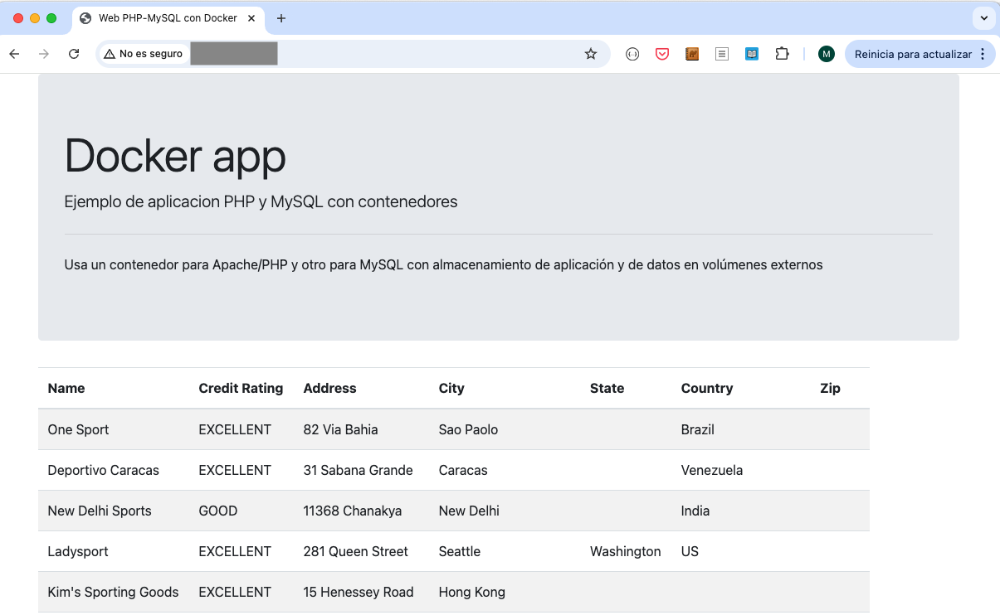

////
NO CAMBIAR!!
Codificación, idioma, tabla de contenidos, tipo de documento
////
:encoding: utf-8
:lang: es
:toc: right
:toc-title: Tabla de contenidos
:doctype: book
:linkattrs:

:figure-caption: Fig.

////
Nombre y título del trabajo
////
# Despliegue de infraestructura cloud con Terraform
Cloud Computing - Máster en Tecnologías y Aplicaciones en Ingeniería Informática
José Joaquín Cañadas y Manuel Torres <jjcanada@ual.es> <mtorres@ual.es>

image::images/di.png[]

// NO CAMBIAR!! (Entrar en modo no numerado de apartados)
:numbered!: 

[abstract]
== Resumen
En este tutorial se muestra el uso de una herramienta como Terraform para construir y modificar infraestructura cloud mediante código. Se estudiarán casos de uso en OpenStack y Google Cloud.

////
COLOCA A CONTINUACION LOS OBJETIVOS
////
.Objetivos
* Conocer el papel de la Infraestructura como código en la cultura DevOps.
* Entender la utilidad y potencia de la Infraestructura como código.
* Inicializar un proveedor cloud en Terraform.
* Desplegar infraestructura en OpenStack y Google Cloud.
* Inicializar las máquinas virtuales en el momento de su creación.

[TIP]
====
Disponible el https://github.com/ualmtorres/terraform-examples.git[repositorio] usado en este tutorial.
====

// Entrar en modo numerado de apartados
:numbered:

## Introducción

Desde hace un tiempo se oye hablar mucho de https://en.wikipedia.org/wiki/DevOps[DevOps]. Se trata de una fusión que combina las áreas de:

* Desarrollo
* Operaciones
* Control de calidad

Es una extensión natural de metodologías https://en.wikipedia.org/wiki/Agile_software_development[Agile] y es habitual el uso de los https://medium.com/@seanguthrie/devops-principles-the-cams-model-9687591ca37a[principios CAMS], cuyas siglas vienen de:

* **C**ultura relacionada con comunicación humana, procesos y herramientas
* **A**utomatización de procesos
* **M**onitorización
* **S**haring feedback, buenas prácticas y conocimiento

En DevOps son habituales las prácticas siguientes:

* Planificación ágil
* Despliegue continuo (_CI/CD_). La subida de cambios al repositorio de código desencadena la ejecución de pruebas automatizadas que finalmente realizan el despliegue de los cambios tras superarse las pruebas.
* Infraestructura como código (_Infrastructure as Code_). Se trata del desarrollo de scripts para las tareas de despliegue y gestión de la infraestructura
* Contenedorización. Combinada con la Infraestructura como código permite el despliegue instantáneo de aplicaciones en contenedores.
* Microservicios. Facilita el aislamiento de problemas y maximiza la producción
* Infraestructura cloud. Favorece la disponibilidad y la automatización.

En esta asignatura ya hemos tratado las prácticas de https://ualmtorres.github.io/AsignaturaCloudComputing/#truetema-2-infraestructura-de-cloud-computing[Infraestructura cloud] y de https://ualmtorres.github.io/AsignaturaCloudComputing/#truetema-4-servicios-de-contenedores[Contenedorización]. En este tema nos centraremos en la Infraestructura como código a la que podríamos caracterizar de esta forma:

* Uso de scripts para configurar de forma automática el entorno (redes, máquinas virtuales, volúmenes, …) con independencia de su estado inicial.
* Versionado y desarrollo colaborativo del código de la infraestructura mediante sistemas de control de versiones.
* Infraestructura repetible.
* Evita errores humanos.
* Se especifica el estado de lo que se quiere.

En este tema estudiaremos https://www.terraform.io/[Terraform], una herramienta para construir, modificar y versionar infraestructura de forma segura y eficiente.

.La cultura DevOps
****
Si esto te parece interesante, puedes dedicar unos minutos a la lectura de estos documentos breves sobre DevOps. Presentan de forma clara y sencilla términos como _DevOps, Integración continua, Microservicios, ..._

* https://docs.microsoft.com/en-us/azure/devops/learn/what-is-devops[DevOps]
* https://docs.microsoft.com/en-us/azure/devops/learn/what-is-continuous-integration[Integración contínua]
* https://docs.microsoft.com/en-us/azure/devops/learn/what-is-continuous-delivery[Entrega contínua]
* https://docs.microsoft.com/en-us/azure/devops/learn/what-is-devops-culture[Cultura DevOps]
* https://docs.microsoft.com/en-us/azure/devops/learn/what-is-infrastructure-as-code[Infraestructura como código]
* https://docs.microsoft.com/en-us/azure/devops/learn/what-are-microservices[Microservicios]
* https://docs.microsoft.com/en-us/azure/devops/learn/what-is-monitoring[Monitorización]
****

## Terraform

https://www.terraform.io/[Terraform] es una herramienta para construir, modificar y versionar infraestructura de forma segura y eficiente. Es un proyecto Open Source surgido en 2014. Genera un plan de ejecución (preview) indicando qué hará para conseguir el estado deseado. Si hay cambios en la configuración, Terraform detecta los cambios y crea un plan incremental para alcanzar el nuevo estado.

### Instalación

La instalación de Terraform es muy sencilla. Se https://www.terraform.io/[descarga] como un binario que hay que descoprimir. Luego se coloca en un directorio incluido en el PATH del sistema. Probamos su funcionamiento desde la terminal con `terraform`

[source, bash]
----
Usage: terraform [-version] [-help] <command> [args]

The available commands for execution are listed below.
The most common, useful commands are shown first, followed by
less common or more advanced commands. If you're just getting
started with Terraform, stick with the common commands. For the
other commands, please read the help and docs before usage.

Common commands:
    apply              Builds or changes infrastructure
    console            Interactive console for Terraform interpolations
    destroy            Destroy Terraform-managed infrastructure
    env                Workspace management
    fmt                Rewrites config files to canonical format
    get                Download and install modules for the configuration
    graph              Create a visual graph of Terraform resources
    import             Import existing infrastructure into Terraform
    init               Initialize a Terraform working directory
    login              Obtain and save credentials for a remote host
    logout             Remove locally-stored credentials for a remote host
    output             Read an output from a state file
    plan               Generate and show an execution plan
    providers          Prints a tree of the providers used in the configuration
    refresh            Update local state file against real resources
    show               Inspect Terraform state or plan
    taint              Manually mark a resource for recreation
    untaint            Manually unmark a resource as tainted
    validate           Validates the Terraform files
    version            Prints the Terraform version
    workspace          Workspace management

All other commands:
    0.12upgrade        Rewrites pre-0.12 module source code for v0.12
    0.13upgrade        Rewrites pre-0.13 module source code for v0.13
    debug              Debug output management (experimental)
    force-unlock       Manually unlock the terraform state
    push               Obsolete command for Terraform Enterprise legacy (v1)
    state              Advanced state management
----

### Sintaxis de los archivos

Hashicorp usa su propio lenguaje de configuración para la descripción de la infraestructura.

Los archivos Terraform se pueden escribir en dos formatos:

* HashiCorp Configuration Language (HCL). La extensión de los archivos es `.tf`
* JSON. La extensión de los archivos es `.tf.json`

El formato preferido es el HCL. Desde Terraform 0.12 está disponible HCL2 y se recomienda usar HCL2.

### Recursos y módulos

El objetivo de Terraform es declarar _recursos_. Todas las características del lenguaje giran en torno a hacer que la definición de recursos sea más flexible y convniente. 

Los recursos puede agruparse en módulos, que crean una unidad de configuración de nivel más alto. Un recurso describe un objeto básico de infraestructura, mientras que un módulo describe un conjunto de objetos y sus relaciones para crear un sistema mayor.

.Title
.Ejemplo de un recurso para crear en OpenStack una IP flotante de la red `ext-net`
====
[source, bash]
----
resource "openstack_networking_floatingip_v2" "tf_vm_ip" {
  pool = "ext-net"
}
----
====

Una configuración Terraform consta de un módulo raíz donde comienza la evaluación. El módulo puede contener módulos hijo que se van llamando unos a otros. La configuración más sencilla de módulo contendría sólo un archivo `.tf` (`main.tf`) aunque se recomienda una organización como la siguiente:

* `main.tf`: Configuración de lo recursos del módulo
* `providers.tf`: Proveedor de los recursos del módulo
* `variables.tf` Variables de entrada
* `output.tf`: Variables de salida

Ejemplo de organización:
[source, bash]
----
├── README.md
├── main.tf
├── providers.tf
├── variables.tf
├── outputs.tf
├── ...
├── modules/
│   ├── moduleA/
│   │   ├── README.md
│   │   ├── main.tf
│   │   ├── providers.tf
│   │   ├── variables.tf
│   │   ├── outputs.tf
│   ├── moduleB/
│   ├── .../
----

### Providers

Terraform puede crear _stacks_ de infraestructura en varios proveedores. Por ejemplo, una configuración podría crear infraestructura en Google Cloud Platform y en OpenStack-DI.

Hay gran cantidad de proveedores Terraform, tanto https://www.terraform.io/docs/providers/index.html[oficiales], mantenidos por Hashicorp, (AWS, Azure, Google Cloud Platform, Heroku, Kubernetes, MongoDB Atlas, OpenStack, VMware Cloud, VMware vSphere, ...) como de la https://www.terraform.io/docs/providers/type/community-index.html[comunidad y terceros] (OpenShift, Trello, Telegram, ...)

### Variables

#### Variables de entrada

Las variables de entrada se usan como parámetros para los módulos. Se crean mediante bloques `variable`

[source, tf]
----
variable "openstack_user_name" {
    type = string
    description = "The username for the Tenant."
    default  = "mtorres"
}

variable "security_groups" {
    type    = list(string)
    default = ["default"]
}
----

Las variables se usan siguiendo esta sintaxis `var.<variable>`.

[source, tf]
----
provider "openstack" {
  user_name   = var.openstack_user_name <1>
  ....
}
----
<1> Uso de la variable `openstack_user_name`

Más información sobre la declaración, uso de variables y constructores de tipos en la https://www.terraform.io/docs/configuration/variables.html[documentación oficial].

#### Variables de salida

Las variables de salida se usan para pasar valores a otros módulos o para mostrar en el CLI un resultado tras un despliegue con `terraform apply`.

Las variables de salida se definen con bloques `output` y un identificador único. Normalmente, toman como valor una expresión (p.e. una IP generada para una instancia creada).

[source, tf]
----
output tf_vm_Floating_IP {
  value      = openstack_networking_floatingip_v2.tf_vm_ip.address <1>
  depends_on = [openstack_networking_floatingip_v2.tf_vm_ip] <2>
}
----
<1> Expresión que devuelve la dirección IP de un recurso previamente creado.
<2> Argumento opcional que establece una dependencia con un recurso creado.

### Archivo de estado

Terraform guarda la información de la infraestructura creada en un archivo de estado Terraform (`terraform.tfstate`). Este archivo se usa al ejecutar los comandos `terraform plan` o `terraform apply` para determinar los cambios a aplicar. Gracias a esto se puede:

* Seguir la pista de los cambios en la infraestructura
* Actualizar sólo los componentes necesarios
* Eliminar componentes

Una caracterísitica muy interesante de Terraform es la idempotencia, así como la facilidad para aplicar cambios. Si volvemos a ejecutar un despliegue con `terraform apply` y no ha habido cambios en los archivos de configuración tras el último despliegue (cuyo estado quedó almacenado en el archivo `.tfstate`), el despliegue quedará intacto. Es decir, no se volverá a crear infraestructura repetida ni se reemplazará la infraestructura creada por una nueva si no hay cambios en los archivos de configuración.

Sin embargo, si modificamos la configuración modificando los archivos Terraform estaremos indicando un nuevo estado al que queremos llegar. En este caso, al aplicar `terraform apply` sí se desplegarán los cambios realizados en la configuración. Sin embargo, sólo se desplegarán los cambios, manteniendo intacta la configuración no modificada.

.Atención al archivo de estado
****
**El archivo de estado puede contener información sensible por lo que debe quedar excluido en el sistema de control de versiones.** 

[TIP]
====
Recuerda incluirlo el archivo de estado en https://github.com/github/gitignore/blob/master/Terraform.gitignore[.gitignore].
====

Además, el estado local no funciona bien en un entorno colaborativo, ya que la ejecución local almacenaría el estado en cada equipo local y no coincidirá con el estado almacenado en otro equipo de otro miembro. Si dos o más personas necesitan ejecutar la configuración Terraform se necesita almacenar el archivo en un lugar remoto a fin de evitar errores y no dañar la infraestructura existente.

Más información sobre https://www.terraform.io/docs/state/remote.html[estado remoto] y https://www.terraform.io/docs/backends/[configuración de backends].

[NOTE]
====
Google Cloud Storage ofrece https://www.terraform.io/docs/backends/types/gcs.html[soporte para el almacenamiento del estado de Terraform] con la opción de bloqueo. Crea un segmento (_bucket_) y activa el versionado de objetos para recuperación de estados anteriores ante errores accidentales. 

Terraform también permite usar una base de datos PostgreSQL para el almacenamiento del estado con la opción de bloqueo. Aprovisiona una máquina virtual con SQL o usa un servicio de PostgreSQL en la nube para el almacenamiento de estado en PostgreSQL.

Actualmente. Terraform da una lista bastante amplia de backends para almacenamiento de estado 

* https://www.terraform.io/docs/backends/types/azurerm.html[Azure Blob Storage]
* https://www.terraform.io/docs/backends/types/consul.html[Consul]
* https://www.terraform.io/docs/backends/types/etcdv3.html[etcd]
* https://www.terraform.io/docs/backends/types/gcs.html[Google Cloud Storage]
* https://www.terraform.io/docs/backends/types/http.html[cliente REST HTTP]. Prueba con este https://medium.com/@meson10/remote-terraform-state-server-47c481983268[ejemplo] en Go MongoDB
* https://www.terraform.io/docs/backends/types/kubernetes.html[Kuberntes Secrets] (Máximo 1 MB)
* https://www.terraform.io/docs/backends/types/pg.html[PostgreSQL]
* https://www.terraform.io/docs/backends/types/s3.html[Amazon S3]
* https://www.terraform.io/docs/backends/types/swift.html[OpenStack Swift]
* ...
====
****
### Gestión de la infraestructura

Estos son los pasos que se deben seguir para construir, mantener y eliminar una infraestructura con Terraform.

. Inicializar el directorio del proyecto Terraform (`terraform init`). El comando descarga todos los componentes necesarios, incluyendo módulos y plugins.
. Crear un plan de ejecución (`terraform plan`). El comando determina las acciones necesarias para alcanzar el estado deseado especificado en los archivos de configuración.
. Crear o modificar la infraestructura (`terraform apply`). Terraform es idempotente. Al usar este comando sólo se ejecutan los cambios que se hayan realizado en los archivos de configuración sin volver a crear lo que ya existe y no se ha modificado. Para esto se utilizan los archivos de estado.
. Mostrar las variables de salida de un despliegue (`terraform output`). 
. Eliminar la infraestructura (`terraform destroy`). Se usa para eliminar la infraestructura creada.

## Despliegue en OpenStack

El provider https://registry.terraform.io/providers/terraform-provider-openstack/openstack/latest/docs[OpenStack] permite crear configuraciones Terraform para desplegar infraestructura en OpenStack. Entre los recursos que podemos gestionar están:

* Instancias
* Credenciales
* Imágenes
* Redes
* Almacenamiento de bloques
* Almacenamiento NFS
* Balanceadores de carga

### Configuración del provider

Para usarlo hay que configurar sus https://registry.terraform.io/providers/terraform-provider-openstack/openstack/latest/docs[parámetros de acceso]. Lo haremos en un archivo `providers.tf`

.El archivo `providers.tf`
[source, tf]
----
provider "openstack" {
  user_name   = var.openstack_user_name
  tenant_name = var.openstack_tenant_name
  password    = var.openstack_password
  auth_url    = var.openstack_auth_url
}
----

Se usan las variables definidas en el archivo `variables.tf`

[source, tf]
----
variable "openstack_user_name" {
    description = "The username for the Tenant."
    default  = "your-openstack-user"
}

variable "openstack_tenant_name" {
    description = "The name of the Tenant."
    default  = "your-openstack-project"
}

variable "openstack_password" {
    description = "The password for the Tenant."
    default  = "your-openstack-password"
}

variable "openstack_auth_url" {
    description = "The endpoint url to connect to OpenStack."
    default  = "http://openstack.di.ual.es:5000/v3"
}

variable "openstack_keypair" {
    description = "The keypair to be used."
    default  = "your-openstack-keypair-name"
}
----

.Uso de variables de entorno
****

Para evitar introducir datos sensibles en los archivos de configuración y evitar que queden expuestos en el sistema de control de versiones es buena práctica configurar valores sensibles en variables de entorno.

El convenio de Terraform es que definamos en la shell las variables predecidas de `TF_VAR_`. Por ejemplo, definimos una variable de entorno `TF_VAR_PASSWORD` que será accedida por Terraform como `PASSWORD`.

.Nomemclatura de variables de entorno
[width="100%",options="header,footer"]
|====================
| Variable de entorno |  Variable Terraform 
| `TF_VAR_PASSWORD` |  `PASSWORD`
|====================

Seguiremos estos pasos:

. Configurar la variables en la shell

+
[source, bash]
----
$ export TF_VAR_PASSWORD=xxxx
----

. Cargar la variable en Terraform 

+
.Archivo `variables.tf`
[source, tf]
----
...
variable "PASSWORD" {} <1>
...
----
<1> La variable de entorno `TF_VAR_PASSWORD` es reconocida en Terraform como `PASSWORD`

. Usar la variable en Terraform

+
.Archivo `providers.tf`
[source, tf]
----
provider "openstack" {
  user_name   = var.openstack_user_name
  tenant_name = var.openstack_tenant_name
  password    = var.PASSWORD <1>
  auth_url    = var.openstack_auth_url
}
----
<1> Uso de la variable
****

### Inicializar el provider

Para inicializar ejecutar `terraform init`.

[source, bash]
----
terraform init

Initializing the backend...

Initializing provider plugins...
- Finding latest version of terraform-provider-openstack/openstack...
- Installing terraform-provider-openstack/openstack v1.33.0...
- Installed terraform-provider-openstack/openstack v1.33.0 (self-signed, key ID 4F80527A391BEFD2)

...

* terraform-provider-openstack/openstack: version = "~> 1.33.0"

Terraform has been successfully initialized!

...
----

Esto creará una carpeta `.terraform` con en plugin de OpenStack instalado y disponible para ser usado en el proyecto.

.Actualización de la configuración
****
Puede que la inicialización informe de un error como este indicando la necesidad de actualización de la configuración.

[source, bash]
----
Error: Failed to install providers

Could not find required providers, but found possible alternatives:

  hashicorp/openstack -> terraform-provider-openstack/openstack

If these suggestions look correct, upgrade your configuration with the
following command:
    terraform 0.13upgrade .
---- 

En tal caso Terraform indicará la forma de solucionarlo. En este caso sugiere solucionarlo con

[source, bash]
----
$ terraform 0.13upgrade . <1>
----
<1> No olvidar el punto del final

Esto creará una archivo `versions.tf` con la actualización del módulo en el directorio actual.

Una vez actualizado, volver a ejecutar

    $ terraform init
****

### Despliegue de una instancia

La creación de una instancia se realiza con https://registry.terraform.io/providers/terraform-provider-openstack/openstack/latest/docs/resources/compute_instance_v2[openstack_compute_instance_v2].

A continuación, crearemos una instancia denominada `tf_vm`. El nombre que se use en `resource`, no el nombre asignado en `name`, es el que referencia al objeto `resource` creado. Esto permite tratar el recurso creado (p.e. para asignarle una dirección IP flotante, para conectarle un volumen, ...).

En el ejemplo siguiente se ilustra la creación de una máquina virtual, una dirección IP flotante (https://registry.terraform.io/providers/terraform-provider-openstack/openstack/latest/docs/resources/networking_floatingip_v2[`openstack_networking_floatingip_v2`]) y la asignación de la IP flotante a la máquina virtual creada (https://registry.terraform.io/providers/terraform-provider-openstack/openstack/latest/docs/resources/compute_floatingip_associate_v2[`openstack_compute_floatingip_associate_v2`]).

[source, terraform]
----
#Crear nodo tf_vm
resource "openstack_compute_instance_v2" "tf_vm" {<1>
  name              = "tf_vm"
  image_name        = "Ubuntu 16.04 LTS"
  availability_zone = "nova"
  flavor_name       = "medium"
  key_pair          = var.openstack_keypair
  security_groups   = ["default"]
  network {
    name = "mtorres-net" <2>
  }
}

resource "openstack_networking_floatingip_v2" "tf_vm_ip" { <3>
  pool = "ext-net"
}

resource "openstack_compute_floatingip_associate_v2" "tf_vm_ip" { <4>
  floating_ip = openstack_networking_floatingip_v2.tf_vm_ip.address <5>
  instance_id = openstack_compute_instance_v2.tf_vm.id <6>
}

output tf_vm_Floating_IP { 
  value      = openstack_networking_floatingip_v2.tf_vm_ip.address <7>
  depends_on = [openstack_networking_floatingip_v2.tf_vm_ip] <8>
}
----
<1> Creación de un recurso instancia (máquina virtual) en OpenStack. El objeto recurso creado es asignado a la variable `tf_vm`.
<2> Red a la que se conectará la instancia creada
<3> Creación de un recurso dirección IP flotante. El objeto recurso creado es asignado a la variable `tf_vm_ip`.
<4> Asociación de la IP flotante a la instancia
<5> Acceso a la dirección del recurso IP flotante creado
<6> Acceso al `id` la instancia creada
<7> Acceso a la dirección del recurso IP flotante creado
<8> Esperar a que esté creado el recurso de la IP flotante

### Modificar el despliegue

A modo de ilustración este ejemplo muestra cómo aplicar cambios a una configuración desplegada previamente. En este caso se trata de:

* Cambiar el _sabor_ de la instancia desplegada.
* Crear un volumen de 1GB (https://registry.terraform.io/providers/terraform-provider-openstack/openstack/latest/docs/resources/blockstorage_volume_v3[`openstack_blockstorage_volume_v3`]).
* Conectar el volumen a la máquina virtual (https://registry.terraform.io/providers/terraform-provider-openstack/openstack/latest/docs/resources/compute_volume_attach_v2[`openstack_compute_volume_attach_v2`]).

[source, terraform]
----
resource "openstack_compute_instance_v2" "tf_vm" {
  name              = "tf_vm"
  image_name        = "Ubuntu 16.04 LTS"
  availability_zone = "nova"
  flavor_name       = "large" <1>
  key_pair          = var.openstack_keypair
  security_groups   = ["default"]
  network {
    name = "mtorres-net"
  }
}

...

resource "openstack_blockstorage_volume_v3" "tf_vol" { <2>
  name        = "tf_vol"
  description = "first test volume"
  size        = 1 <3>
}

resource "openstack_compute_volume_attach_v2" "va_1" { <4>
  instance_id = "${openstack_compute_instance_v2.tf_vm.id}" <5>
  volume_id   = "${openstack_blockstorage_volume_v3.tf_vol.id}" <6>
}
----
<1> Modificación del sabor de la imagen
<2> Creación de un recurso volumen
<3> Especificación del tamaño del volumen
<4> Conexión del volumen a la instancia
<5> Acceso al `id` la instancia
<6> Acceso al `id` del volumen creado

Al ejecutar con `terraform apply`, Terraform nos informará de los cambios detectados y de la nueva configuración. La nueva configuración se aplicará si confirmamos la operación.

### Ejecutar un script de inicialización

Una característica muy interesante en el despliegue de una instancia es la posibilidad de ejecutar un script de inicialización durante su creación. Esto permite la creación de instancias con paquetes instalados y configurados.

Terraform permite esta operación en OpenStack pasando un script en el parámetro `user_data` al crear la instancia. 

[NOTE]
====
Si se modifica el valor de `user_data` se creará un nuevo servidor si se usa `terraform apply`.
====

A continuación se muestra un script `install_mysql.sh` que realiza varias operaciones:

* Actualizar el repositorio de paquetes.
* Instalar un servidor MySQL con el password `my_password`.
* Descargar un archivo con un script SQL para inicializar una base de datos de ejemplo.
* Ejecutar el archivo SQL para inicializar la base de datos.
* Modificar el archivo de configuración de MySQL (`mysqld.cnf`) para que admita conexiones desde cualquier lugar.

.El script `install_mysql.sh`
[source, bash]
----
#!/bin/bash

sudo debconf-set-selections <<< 'mysql-server mysql-server/root_password password my_password'
sudo debconf-set-selections <<< 'mysql-server mysql-server/root_password_again password my_password'
sudo apt-get update
sudo apt-get -y install mysql-server
wget https://gist.githubusercontent.com/ualmtorres/55325478004104fbe828683ea5131e40/raw/0c8edc5750cac0a6a5796544860c8cd94d5c94ac/sginit.sql -O /home/ubuntu/sginit.sql
mysql -h "localhost" -u "root" "-pmy_password" < "/home/ubuntu/sginit.sql"

sudo sed -i 's/127.0.0.1/0.0.0.0/g' /etc/mysql/mysql.conf.d/mysqld.cnf
sudo service mysql restart
----

Para crear la instancia con Terraform basta con crear el recurso pasando a la propiedad `user_data` el nombre y la ruta del script de inicialización. En este caso, se supone que el script de inicialización está en el mismo directorio que el script Terraform.

[source, tf]
----
#Crear nodo mysql
resource "openstack_compute_instance_v2" "mysql" {
  name              = "mysql"
  image_name        = "Ubuntu 16.04 LTS"
  availability_zone = "nova"
  flavor_name       = "medium"
  key_pair          = "mtorres_ual"
  security_groups   = ["default"]
  network {
    name = "desarrollo-net"
  }

  user_data = file("install_mysql.sh") <1>
}
----
<1> Pasar el script de inicialización de la instancia

### Archivos de plantilla

Una caracteística muy interesante de Terraform es la posibilidad de definir scripts con contenido dinámico. Se trata de arcchivos que interpolan el valor de variables generadas durante el proceso de despliegue.

El procedimiento es el siguiente:

* Generar variables de salida 
* Crear archivos de plantilla con extensión `.tpl` que obtengan los valores de dichas variables con la sintaxis siguiente `${nombre-variable}`.
* Interpolar mediante la función `templatefile` donde sea necesario los archivos plantilla con la sintaxis siguiente `data.template_file.objeto-template-file.rendered`.

Para ilustrar su uso:

* Interpolaremos las variables en el archivo de plantilla
* Crearemos una plantilla que obtenga la dirección IP de un servidor MySQL creado en el despliegue (almacenada en una variable `output`). Dicha variable se usará para definir una variable de entorno en la instancia definida y para cambiar las variables de entorno de Apache.
* Crearemos una instancia inicializada con el archivo de la plantilla. La instancia será un servidor web inicializado con una aplicación PHP sencilla. La aplicación usará la variable de entorno inicializada por el script. La variable de entorno contiene la dirección IP del servidor MySQL al que accede la aplicación para mostrar sus datos.

.Proceso de interpolación de las variables en el archivo `main.tf`
[source, tf]
----
data "template_file" "install_appserver" {
  template = file("install_appserver.tpl") <1>
  vars = {
    mysql_ip = openstack_compute_instance_v2.mysql.network.0.fixed_ip_v4 <2>
  }
  depends_on = [openstack_compute_instance_v2.mysql] <3
}
----
<1> Archivo de plantilla
<2> Inicialización de la variable
<3> Esperar a que esté creada la instancia para obtener su IP.

.Archivo plantilla `install_appserver.tpl`
[source, bash]
----
#!/bin/bash
echo "export MYSQL_SERVER=${mysql_ip}" >> /home/ubuntu/.profile <1>

sudo apt-get update
sudo apt-get install -y apache2 php php-mysql libapache2-mod-php php-mcrypt
sudo chgrp -R www-data /var/www
sudo chmod -R 775 /var/www
sudo chmod -R g+s /var/www
sudo useradd -G www-data ubuntu
sudo chown -R ubuntu /var/www/

sudo rm /var/www/html/index.html
wget https://gist.githubusercontent.com/ualmtorres/1c833f9b471fa7351e2725731596f45e/raw/a66b26d90b5f75c3a37cfe12a2370b57d2768132/sginit.php -O /var/www/html/index.php

echo "export MYSQL_SERVER=${mysql_ip}" >> /etc/apache2/envvars <2>
sudo service apache2 restart
----
<1> Inicialización de una variable de entorno con el valor de la variable `mysql_ip`.
<2> Inicialización de una variable de entorno Apache con el valor de la variable `mysql_ip`.

.Creación del recurso con el script de inicialización interpolado
[source, bash]
----
#Crear nodo appserver
resource "openstack_compute_instance_v2" "appserver" {
  name              = "appserver"
  image_name        = "Ubuntu 16.04 LTS"
  availability_zone = "nova"
  flavor_name       = "medium"
  key_pair          = "mtorres_ual"
  security_groups   = ["default"]
  network {
    name = "desarrollo-net"
  }

  user_data = data.template_file.install_appserver.rendered <1> 

  depends_on = [openstack_compute_instance_v2.mysql]

}
----
<1> Interpolación del archivo plantilla

### Ejemplo completo

En este apartado crearemos un escenario más complejo que combine creación de recursos de red e instancias aprovisionadas durante su creación.

Se trata de crear lo siguiente:

* Red denominada `desarrollo-net`. Contendrá una subred denominada `desarrollo-subnet` con direcciones `10.2.0.0./24` y estos servidores DNS: `150.214.156.2 8.8.8.8`.
* Router denominado `desarrollo-router` que conecte la red exterior `ext-net` con la red `desarrollo-net` creada anteriormente.
* Un servidor MySQL inicializado con el script `install_mysql.sh`
* Un servidor Web con PHP inicializado con el script `install_appserver.tpl`

La figura siguiente ilustra el diagrama de la infraestructura.

image::images/EjemploCompleto.png[]

Tras finalizar el despliegue tendremos la configuración de red realizada, un servidor MySQL con una base de datos inicializada y servidor web con aplicación PHP de catálogo de productos desplegada. Terraform nos informará con las variables de salida.

[source]
----
Apply complete! Resources: 10 added, 0 changed, 0 destroyed.

Outputs:

Appserver_Floating_IP = 192.168.68.112
MySQL_Floating_IP = 192.168.68.135
----

Si accedemos a la dirección IP del servidor web veremos la aplicación de catálogo mostrando los productos almacenados en la base de datos.

image::images/SGApp.png[]

## Despliegue en Google Cloud

El provider https://registry.terraform.io/providers/hashicorp/google/latest/docs[Google Cloud] permite crear configuraciones Terraform para desplegar configuraciones en el gran conjunto de servicios de Google Cloud. Entre los recursos que podemos gestionar están:

* Infraestructura (Instancias, Imágenes, Redes, ...)
* App Engine
* Bases de datos (Cloud SQL, Big Query, Firebase, ...)
* Kubernetes
* Cloud Storage
* ...

### Crear una clave para la Cuenta de servicio

* Seleccionar el proyecto Google Cloud.
* En el menú de navegación seleccionae `IAM y administración | Cuentas de servicio`.
* Seleccionar `Crear cuenta de servicio`.
* Darle un nombre (p.e. `terraform`)
* Seleccionar Crear.
* En el paso `Conceder a esta cuenta de servicio acceso al proyecto` del asistente, seleccionar el rol `Proyecto -> Editor`.
* Editar la Cuenta de servicio. En la sección `Claves` seleccionar `Añadir clave | Crear clave`.
* Dejar `JSON` en el tipo de clave..
* Seleccionar `Crear`. A continuación se descargará la clave privada.

### Configuración del provider

Para usarlo hay que configurar sus https://registry.terraform.io/providers/hashicorp/google/latest/docs[parámetros de acceso]. Lo haremos en un archivo `providers.tf`

.El archivo `providers.tf`
[source, tf]
----
terraform {
  required_providers {
    google = {
      source = "hashicorp/google"
    }
  }
}

provider "google" {
  version = "3.5.0"

  credentials = file("../gcp-identity.json")

  project = var.gcp-project
  region  = "us-central1"
  zone    = "us-central1-c"
}
----

Se usan las variables definidas en el archivo `variables.tf`

[source, tf]
----
variable "gcp-username" {
  description = "GCP user name"
  default     = "mtorres"
}

variable "gcp-project" {
  description = "GCP project"
  default     = "cc2021-clouddi"
}
----

### Inicializar el provider

Para inicializar ejecutar `terraform init`.

[source, bash]
----
Initializing the backend...

Initializing provider plugins...
- Finding hashicorp/google versions matching "3.5.0"...
- Installing hashicorp/google v3.5.0...
- Installed hashicorp/google v3.5.0 (signed by HashiCorp)

Terraform has been successfully initialized!

You may now begin working with Terraform. Try running "terraform plan" to see
any changes that are required for your infrastructure. All Terraform commands
should now work.

If you ever set or change modules or backend configuration for Terraform,
rerun this command to reinitialize your working directory. If you forget, other
commands will detect it and remind you to do so if necessary.
----

Esto creará una carpeta `.terraform` con en plugin de Google Cloud instalado y disponible para ser usado en el proyecto.

### Despliegue de una instancia

La creación de una instancia se realiza con https://registry.terraform.io/providers/hashicorp/google/latest/docs/resources/compute_instance[google_compute_instance].

A continuación, crearemos una instancia denominada `tf-vm`. El nombre que se use en `resource`, no el nombre asignado en `name`, es el que referencia al objeto resource creado. Esto permite tratar el recurso creado (p.e. para asignarle una dirección IP fija, para conectarle un volumen, …​).

En el ejemplo siguiente se ilustra la creación de una máquina virtual con una dirección IP efímera.

[NOTE]
====
De forma predeterminada, si no se indica ninguna dirección IP fija, Google Cloud creará una efímera para la máquina virtual.
====

[source, tf]
----
resource "google_compute_instance" "tf-vm" { <1>
  name         = "tf-vm"
  zone         = "us-central1-a"
  machine_type = "n1-standard-1"
  boot_disk {
    initialize_params {
      image = "ubuntu-os-cloud/ubuntu-1804-lts"
    }
  }

  # Add SSH access to the Compute Engine instance
  metadata = {
    ssh-keys = "${var.gcp-username}:${file("~/.ssh/id_rsa.pub")}"
  }

  # Startup script
  # metadata_startup_script = "${file("update-docker.sh")}"

  network_interface { <2>
    network    = "default"
    subnetwork = "default"

    access_config {} <3>
  }
}

output "tf-vm-internal-ip" { <4>
  value      = google_compute_instance.tf-vm.network_interface.0.network_ip
  depends_on = [google_compute_instance.tf-vm]
}

output "tf-vm-ephemeral-ip" { <5>
  value      = google_compute_instance.tf-vm.network_interface.0.access_config.0.nat_ip
  depends_on = [google_compute_instance.tf-vm]
}
----
<1> Creación de un recurso instancia (máquina virtual) en Google Cloud. El objeto recurso creado es asignado a la variable `tf-vm`.
<2> Red a la que se conectará la instancia creada.
<3> Dejar `access_config` sin configurar hará que se genere una dirección IP efímera.
<4> Dirección IP interna de la instancia
<5> Dirección IP efímera de la instancia

### Modificar el despliegue

A modo de ilustración este ejemplo muestra cómo aplicar cambios a una configuración desplegada previamente. En este caso se trata de:

* Cambiar el tipo de máquina de la instancia desplegada a `n1-standard-2`.

Crear un volumen de 1GB (https://registry.terraform.io/providers/hashicorp/google/latest/docs/resources/compute_disk[`google_compute_disk`]).

Conectar el volumen a la máquina virtual (https://registry.terraform.io/providers/hashicorp/google/latest/docs/resources/compute_attached_disk[`google_compute_attached_disk`]).

[source, tf]
----
resource "google_compute_instance" "tf-vm" {
  name         = "tf-vm"
  zone         = "us-central1-a"
  machine_type = "n1-standard-2" <1>
  boot_disk {
    initialize_params {
      image = "ubuntu-os-cloud/ubuntu-1804-lts"
    }
  }
...
resource "google_compute_disk" "tf-disk" { <2>
  name = "tf-disk"
  type = "pd-ssd" <3>
  zone = "us-central1-a" <4>
  size = 1 <5>
}

resource "google_compute_attached_disk" "attached-tf-disk" {<6>
  disk     = google_compute_disk.tf-disk.id <7>
  instance = google_compute_instance.tf-vm.id <8>
}
----
<1> Modificación del tamaño de la imagen
<2> Creación de un recurso volumen
<3> Tipo SSD
<4> Zona en la que se localiza el almacenamiento
<5> Especificación del tamaño del volumen
<6> Conexión del volumen a la instancia
<7> Acceso al id del volumen creado
<8> Acceso al id de la instancia

Al ejecutar con `terraform apply`, Terraform nos informará de los cambios detectados y de la nueva configuración. La nueva configuración se aplicará si confirmamos la operación.

### Ejecutar un script de inicialización

Una característica muy interesante en el despliegue de una instancia es la posibilidad de ejecutar un script de inicialización durante su creación. Esto permite la creación de instancias con paquetes instalados y configurados.

Terraform permite esta operación en OpenStack pasando un script en el parámetro `metadata_startup_script` al crear la instancia.

[NOTE]
====
Si se modifica el valor de `metadata_startup_script` se creará un nuevo servidor si se usa `terraform apply`.
====

A continuación se muestra un script `install_mysql.sh` que realiza varias operaciones:

* Actualizar el repositorio de paquetes.
* Instalar un servidor MySQL con el password `my_password`.
* Descargar un archivo con un script SQL para inicializar una base de datos de ejemplo.
* Ejecutar el archivo SQL para inicializar la base de datos.
* Modificar el archivo de configuración de MySQL (`mysqld.cnf`) para que admita conexiones desde cualquier lugar.

.El script install_mysql.sh
[source, bash]
----
#!/bin/bash

sudo debconf-set-selections <<< 'mysql-server mysql-server/root_password password my_password'
sudo debconf-set-selections <<< 'mysql-server mysql-server/root_password_again password my_password'
sudo apt-get update
sudo apt-get -y install mysql-server
wget https://gist.githubusercontent.com/ualmtorres/55325478004104fbe828683ea5131e40/raw/0c8edc5750cac0a6a5796544860c8cd94d5c94ac/sginit.sql -O /home/ubuntu/sginit.sql
mysql -h "localhost" -u "root" "-pmy_password" < "/home/ubuntu/sginit.sql"

sudo sed -i 's/127.0.0.1/0.0.0.0/g' /etc/mysql/mysql.conf.d/mysqld.cnf
sudo service mysql restart
----

Para crear la instancia con Terraform basta con crear el recurso pasando a la propiedad `metadata_startup_script` el nombre y la ruta del script de inicialización. En este caso, se supone que el script de inicialización está en el mismo directorio que el script Terraform.

[source, bash]
----
resource "google_compute_instance" "tf-vm" {
  name         = "tf-vm"
  zone         = "us-central1-a"
  machine_type = "n1-standard-1"
  boot_disk {
    initialize_params {
      image = "ubuntu-os-cloud/ubuntu-1804-lts"
    }
  }

  # Add SSH access to the Compute Engine instance
  metadata = {
    ssh-keys = "${var.gcp-username}:${file("~/.ssh/id_rsa.pub")}" <1>
  }

  tags = ["ssh", "http"]

  # Startup script
  metadata_startup_script = file("setup-docker.sh")

  network_interface {
    network    = "default"
    subnetwork = "default"

    access_config {}
  }
}
----
<1> Pasar el script de inicialización de la instancia

### Despliegue de aplicación Docker Compose

En este apartado veremos cómo crear una instancia aprovisionada con Docker y Docker Compose. Además, la instancia se inicializará con un archivo `docker-compose.yml` que despliega dos contenedores: un contenedor MySQL con una base de datos inicializada y otro contenedor con una aplicación PHP que muestra un catálogo de productos almacenados en el contenedor MySQL.

La aplicación deberá ser accesible en Internet. Por tanto, hay que definir una regla en el cortafuegos que permita la comunicación HTTP. Aprovecharemos la configuración para definir también una regla para la comunicación SSH. Cada regla tendrá un etiqueta asociada. Las instancias que deseen aplicar la regla incluirán la etiqueta correspondiente en su definición.

.El archivo `network-firewall.tf`
[source, bash]
----
# allow http traffic
resource "google_compute_firewall" "allow-http" {
  name    = "tf-fw-allow-http" <1>
  network = "default" <2>
  allow {
    protocol = "tcp"
    ports    = ["80"] <3>
  }
  target_tags = ["http"] <4>
}

# allow ssh traffic
resource "google_compute_firewall" "allow-ssh" { 
  name    = "tf-fw-allow-ssh" <5>
  network = "default" <6>
  allow {
    protocol = "tcp" 
    ports    = ["22"] <7>
  }
  target_tags = ["ssh"] <8>
}
----
<1> Nombre de la regla del firewall
<2> Red a la que se aplica la regla definida
<3> Puerto abierto
<4> Etiqueta para poder usar la regla
<5> Nombre de la regla del firewall
<6> Red a la que se aplica la regla definida
<7> Puerto abierto
<8> Etiqueta para poder usar la regla

[source, bash]
----
resource "google_compute_instance" "tf-vm" {
  name         = "tf-vm"
  zone         = "us-central1-a"
  machine_type = "n1-standard-1"
  boot_disk {
    initialize_params {
      image = "ubuntu-os-cloud/ubuntu-1804-lts"
    }
  }

  # Add SSH access to the Compute Engine instance
  metadata = {
    ssh-keys = "${var.gcp-username}:${file("~/.ssh/id_rsa.pub")}"
  }

  tags = ["ssh", "http"] <1> 

  # Startup script
  metadata_startup_script = file("setup-docker.sh") <2>

  network_interface {
    network    = "default"
    subnetwork = "default"

    access_config {}
  }
}
----
<1> Reglas del firewall a aplicar a la instancia
<2> Script de inicialización de la instancia

.El script `setup-docker.sh` de inicialización de la instancia
[source, bash]
----
#!/bin/bash

echo "Instalando Docker"

apt-get update
apt-get install -y \
    apt-transport-https \
    ca-certificates \
    curl \
    gnupg-agent \
    software-properties-common
curl -fsSL https://download.docker.com/linux/ubuntu/gpg | apt-key add -
apt-key fingerprint 0EBFCD88
add-apt-repository \
   "deb [arch=amd64] https://download.docker.com/linux/ubuntu \
   $(lsb_release -cs) \
   stable"
apt-get update
apt-get install -y docker-ce docker-ce-cli containerd.io <1>
systemctl enable docker

echo "Instalando Docker Compose" <2>
curl -L "https://github.com/docker/compose/releases/download/1.25.4/docker-compose-$(uname -s)-$(uname -m)" -o /usr/local/bin/docker-compose
chmod +x /usr/local/bin/docker-compose

git clone https://github.com/ualmtorres/docker_customer_catalog.git <3>
cd docker_customer_catalog
docker-compose up -d <4>

exit 0
----
<1> Instalación de Docker
<2> Instalación de Docker Compose
<3> Clonado del repositorio con el archivo de despliegue, la aplicación y el script de inicialización de la base de datos
<4> Despliegue del entorno (Base de datos + Aplicación)

La figura siguiente ilustra el resultado tras unos minutos que se necesitan para la creación e inicialización de la instancia y despliegue de la base de datos y la aplicación de catálogo.

### Recursos de interés

https://learn.hashicorp.com/collections/terraform/gcp-get-started[Tutorial Get Started - Google Cloud con Terraform]

https://medium.com/google-cloud/deploying-docker-images-to-cloud-run-using-terraform-ee8ae4ecb72e[Tutorial Serverless Deployment on Cloud Run using Terraform] y https://www.sethvargo.com/configuring-cloud-run-with-terraform/[Configuring Cloud Run with Terraform]

[NOTE]
====
Actualmente, el provider para Cloud Run sólo permite acceso al puerto 8080 del contenedor. Por tanto, las imágenes Docker tienen que servir su contenido a través de ese puerto para un despliegue en Cloud Run desde Terraform.
====

